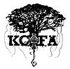
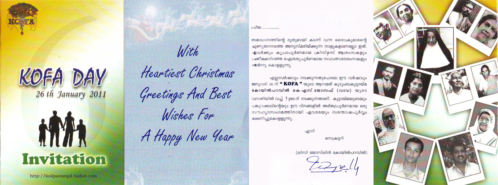
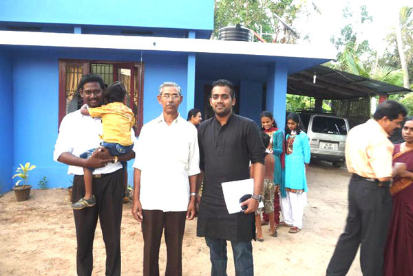
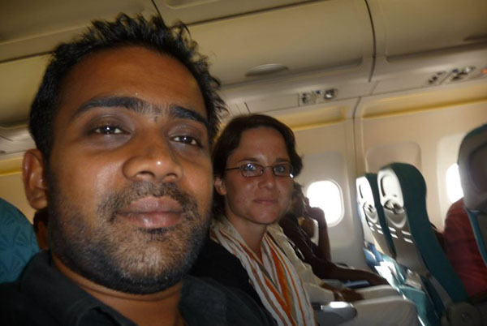
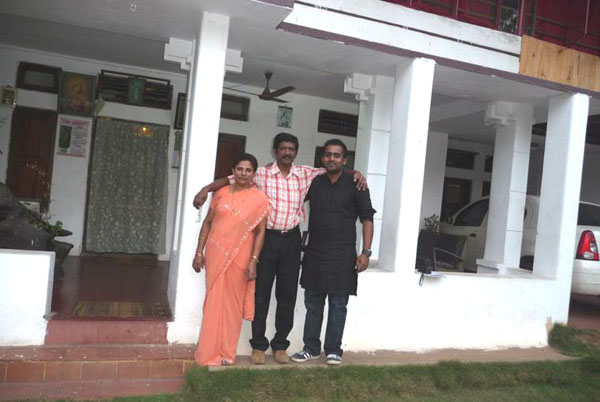
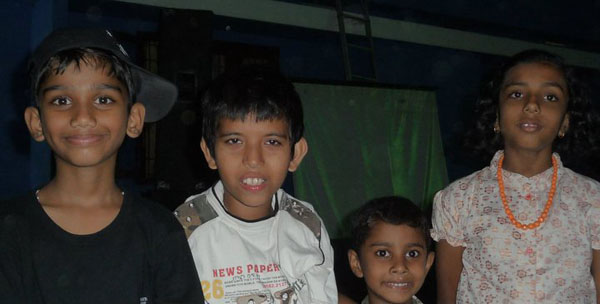
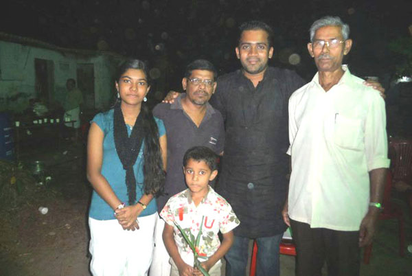
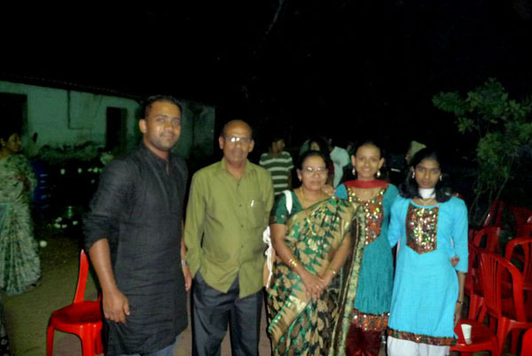

# COFA

**KOILPARAMPIL FAMILY ASSOCIATION (Kudumbayogam) - WORLDWIDE KOFA**

**AIMS**

1\. To increase co-operation and friendship among the members of Koilparampil (Coilparampil) family.

2\. To encourage members to help each other and grow together.

3\. To identify the creativity among members and use it for the welfare of everybody.

4\. To keep up the tradition and reputation of Koilparampil family and make the future generation aware of the importance and relevance of Koilparampil family.

**KOFA Emblem**

The 6 roots in the family emblem represent the 6 branches of the koilparampil family. These 6 branches not only nourish and strengthen, but also expand the reach of the core while anchoring the tree firm with support as it grows. The cross within the emblem of KOFA at the very base of the tree represents the firm Christian foundation of the Family.

**Photos of 6th KOFA meeting on 26 Jan 2010**

 [COFA 2011](http://gallery.bizhat.com/)

**7th KOFA meeting on 1st May 2013**

The seventh meeting of the Koilparampil kudumbayogam (KOFA) was held at Shri. Lal Koilparampil's house at Arthunkal on Wednesday, 1 May 2013 at 7.30 pm. The meeting started with a hymn and a prayer. Shri. Lal welcomed the family members and as the eldest member present, presided the meeting. A memorial talk on the departed family members - KC Eapen, KA Varghese, Giji, Belsita Edison - were done by Shri. Lal. Smt Lisy Joselin, Secreatry, read the minutes and was approved by the meeting. Around 50 family members were present on the occasion.

The talk of Shri Sebatian Eapen (Gazi) was very interesting, informative and motivating. During the meeting, new kudumbayogam committee members were unanimously nominated for the conduct of 8th KOFA in 2014.

Lal Koilparampil - President

Joselin Amby - Vice President

Yujin Pasil - Secretary

Sebastian Eapen - Treasurer

Sunoj Sebastian - Member

Saneesh George - Member

Jaideep Oommen - Member

A delicious dinner followed and the meeting was concluded at 10 pm.

[Koilparampil Photo Gallery](http://gallery.bizhat.com/u19920-koilparampil.html)
