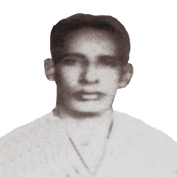
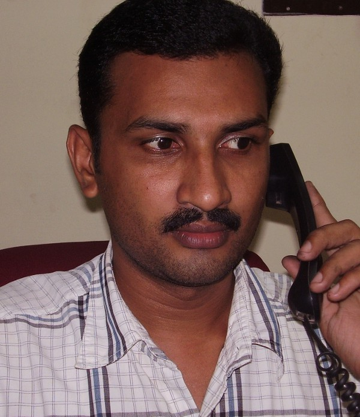

# Cheriyan (son of K.C.Varkey 2.K.F.83 )

- Branch : [Branch 2](Branch_2.md)
- Father : [K.C. Varkey](K.C._Varkey_son_of_Cheriyan_2.K.F.1-2.md)
- Brothers & Sisters : Kathrey , [K.V.Cheriyan](Cheriyan_son_of_K.C.Varkey_2.K.F.83.md) , [K.V.Joseph](Joseph_son_of_K.C.Varkey_2.K.F.83.md)
- Childrens : Varghese , Thomas , Theyamma , Marey , Rossy , Ealamma

---

## K.V.CHERIYAN

2.K.F.85/G10(2)**K.V.CHERIYAN** 1910 [2.T.F.83] married Anna, daughter of Thomas Thumba, Valamanglam, Cherthala.

G.11.

1.  Varghese 1935 (2.K.F.86).
2.  Thomas 1937(2.K.F.96).
3.  Theyamma 1939 (2.K.F.97).
4.  Marey 1941(2.K.F.98).
5.  Rossy 1943 (2.K.99).
6.  Ealamma 1945(2.K.100).

 [VARGHESE](http://gallery.bizhat.com/Mr.K.C)

2.K.F.86/G11(1)K.C VARGHESE 10.12.1935-13.10.1983 [2.T.F.85] married Ealy 14.5.1937, daughter of Ouseph and Ealiyamma, Maduraveliyil, Manappuram, Cherthala.

G.12.

1.  Kunjumol (Annamma)24.9.1961(2.K.F.87).
2.  Joy Cheriyan. 23.1.1964 (2.K.F.88).
3.  Salamma (Ealy)2.3.1966(2.K .89).
4.  Lalichan 5.6.1968(2.K.F.90.).
5.  Sibichan (John)13.2.1971(2.K.F.91).
6.  Jaicy (Thresya) 1.10.1973(2.K.F.92).
7.  Jessy(Mariyam)1.10.1973 (2.K.F.93).
8.  Joby(Thomas)14.8.1976(2.K.F.94.).
9.  Jogy (Varghese) 17.1.1979.(2.K.F.95).

2.K.F.87/G12(1)NNAM KUNJUMOLE (AMA) B.Com. 24.9.1961 [2.T.F.86] Married Raju Varghese Joseph), 1961 son of Varghese and Mariyam Kalluvettankuzhyil, Athirampuzha.

G.13.

1.  Rintoo 1989
2.  Rima1993.
3.  Reethu1995.

2.K.F.88/G12(2).K.V. JOY (CHERIYAN) B.Sc. 23.1.1964 [2.T.F. 86] married Laly D.Pharm., daughter of Emmanuel and Mariyakutty, Pullenkannappally, Kothanelloor. Address : Joy Varghese, Padinjara, Koiparampil, Nirmala Bhavan, Manapuram P.O., Cherthala. Ph. 0478-253 2667.

G.13.

1.  Jubil 1996.

2.K. 89/G12(3).SALAMMA (EALY)2.3.1966[2.T.F. 86] remained as bachelor girl.

2.K.F.90/G12(4). K.V. LALICHAN (JOSE) Mech. Diploma 25.6.1968. [2.T.F.78] He is employed in Oil refinery Mumbai. He married Simi (Mary) M.Sc., B.Ed. (H.S.A.teacher St. Joseph higher Secondary school, Alappuzha.) daughter of Antony Mathew and Thresiyamma, Nellikunnath (Meathicalam), Thumpoly. This family settled at Paravoor, Alappuzha.

G.13.

1.  Christy 1997.
2.  Sneha 2000.

2.K.F.91/G12(5). K.V. SIBICHAN (JOHN)[2.T.F. 86] B.Sc.Tech.(Textail) 13.12.1971 married Nisha, daughter of Thomas Baby and Rithamma Puthanvely, Pallipuram.

G.13.

1.  Anumole 1999.

2.K.F.92/G12(6)JAISSY(THRESSYA) [2.T.F. 86] Hindi Praveen (Teacher) 1.10.1973 twin sister of Jessy (2.K.F.85) married Biju B.Sc. son of Thomas and Thresiyamma, Pallathussery at Changanassery.

2.K.F.93/G12(7)JESSY (MARIYAM)1.10.1973[2.T.F. 86] Hindi Praveen (teacher) married Rengi B.A; PGDSM, son of Joseph and Sophy Pattyil, Nadumbassery, Ernakulam.

G.13.

1.  Joby Thomas A.S.E. 14.8.1976.

 [Mr.K.V. JOBY (THOMAS)](http://gallery.bizhat.com/)

2.K.F.94/G12(8)K.V. JOBY (THOMAS) [2.T.F. 86] 14.8.1976

2.K.F.95/G12(9)K.V.JOGY (VARGHESE)[2.T.F. 86] Electrical & Instrumentation 14.4.1979

2.K.F.96/G11(2). THOMAS 1937 [2.T.F.85] married Thressyamma daughter of Ouseph and Annamma Kalapurackal

G.12.

1.  Jesha 1981
2.  Jigo 1984
3.  Jini 1987.

2.K.F.97/G11(3) THEYAMMA 1939[2.T.F.85] married Joseph, son of Thomas Vettuvazhiyl, at Thalayolaparamp.

G.13.

1.  Sheela(Sr.Neetha)1966.
2.  Sherly 1969.
3.  Shibu 1973-1976.
4.  Shabu 1976.

2.K.F.98/G11(4)MARY 1941 [2.T.F.85] married George, son of Varkey and Mariyam Mattathuvely at Manappuram.

G.12.

1.  Jaimon1970.
2.  Jaibe 1972.
3.  Jainy 1974.
4.  Jaison 1976.
5.  Jaigu1979.
6.  Jaissy 1982.

2.K.99/G11(5).ROSY(Sr.Roselet)1943 [2.T.F.85]

2.K.100/G11(6).EALAMMA (Sr.Reajes) 1945 [2.T.F.85]
