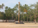

# Dhumini (son of Jusay(6.K.F.63)

- Branch : [Branch 6](Branch_6.md)
- Father : [Jusay](Jusay_son_of_Pathrose_6.K.F.50.md)
- Brothers : [Thoma](Thoma_son_of_Jusay_6.K.F.63.md) , Pranchies , Karbikutty , George , Mareena , [Pranchies](Pranchies_son_of_Jusay_6.K.F.63.md) , [Dhumini](Dhumini_son_of_Jusay_6.K.F.63.md) , Rosary
- Childrens: Roy , Sebastion , Yesudas

---

## DHUMINI

 [Click On Click->](http://gallery.bizhat.com)

6.K.F.71/G12(7).DHUMINI(Dominic)(f)1938 [6.T.F.63] married Sosamma 1944,daughter of Francies and Emily Vadackeveettil at Azhickal. Phone no.0478-257 3033.

 [Click On Click->](http://gallery.bizhat.com/solemn-declaration-of-basilica-of-arthunkal/p205117-standrews-basilica-arthunkal.html)

G.13.

1.  Roy13.1.1969(6.K.F.72).
2.  Sebastion 14.4.1971 (6.K.F.73).
3.  Yesudas 30.5.1975(6.K.F.74).

6.K.F.72/G13(1). K.D.ROY 13.1.1969 B.Tech. [6.T.F.71] married From Vyttila.

G14

1.  ROY

6.K.F.73/G13(2).K.D.SEBASTION 14.4.1971 I.T.I. Die Maker [6.T.F. 71] married Celin, daughter of Jusenju and Komseetha, Cheryassery at Azhickal.

G14

1.  SEBASTION
2.  SEBASTION

 [Click On Click->](http://gallery.bizhat.com)

6.K.F.74/G13(3) K.D.YESUDAS 30.5.1975 [6.T.F.70] I.T.C. (Fitter).married

G14

1.  YESUDAS
