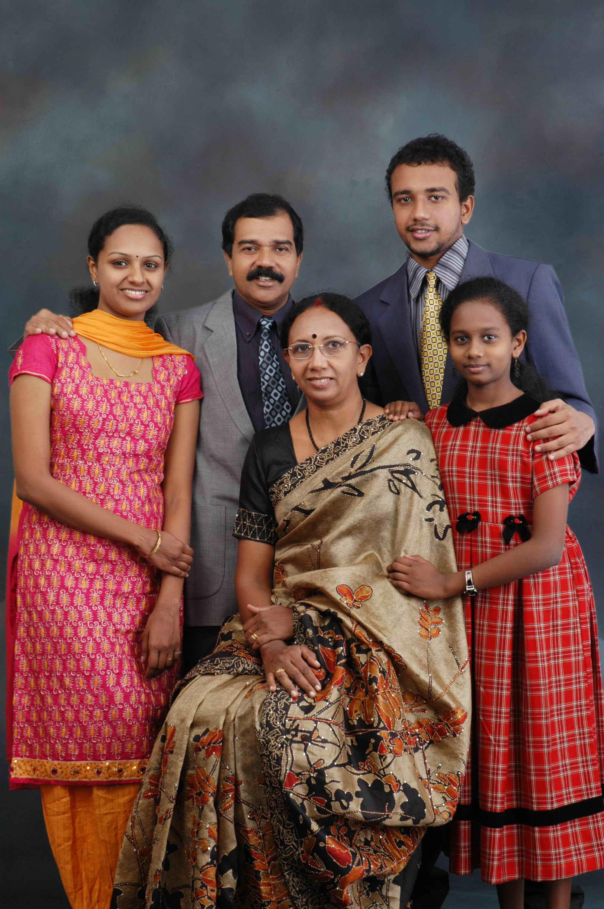

# Dr.Thomas (Monappan)(son of K.J.Sebastin (Kunjappan)3.K.F.220)

- Branch : [Branch 3](Branch_3.md)
- Father: [K.J.Sebastin](<K.J.Sebastin(son_of_K.S.Joseph_3.K.F.218).md>)
- Brothers & Sisters :[Marey Kutty](<K.A.Josey_(son_of_K.S.Antony_3.K.F.254).md>),[K.S.Joseph (Vava)](<K.S.Joseph_(Vava)(son_of_K.J.Sebastin_(Kunjappan)3.K.F.220).md>)(3.K.F.222).,[Dr.Thomas (Monappan)](<Dr.Thomas_(Monappan)(son_of_K.J.Sebastin_(Kunjappan)3.K.F.220).md>)(3.K.F.223).

## Dr. THOMAS KOILPARAMPIL BSc, MBBS, MD, DMRJ, DIM, DPE

- 3.K.F.223/G12(3).**Dr. THOMAS KOILPARAMPIL BSc, MBBS, MD, DMRJ, DIM, DPE.**3.T.F.220 is a leading Indian oncologist, specially trained in Cancer care, from Oxford, UK. Dr Thomas Koilparambil DMRT, MD, PG Diploma(PR) is an Associate Professor in the Department of Oncology and also as the consultant in Cancer pain management at the Regional Cancer Center, Thiruvananthapuram. He is also one of the Chief Editors of Austral-Asian Journal of Cancer.

 [Click On Click->](http://gallery.bizhat.com/branch-3/p220038-dr-thomas-family.html)

He had received gold medal and state merit during his academic pursuit. Before he joined in Govt. service he had started a Hospital in his native village which received the praise of the whole village. He married **Dr. Rita, MBBS, DCP** daughter of John Cruz and Agnes Cruz of Mundakkal, Kollam. She is working as the bacteriologist at the state TB center, Thiruvananthapuram. The family is settled at Thiruvananthapuram.

**Address :** Dr. THOMAS KOILPARAMBIL MD, 13/1606 (1), Christmas, Burma Road, Kumarapuram, Medical college P.O, Thiruvananthapuram Pin: 695011. Ph: 0471 2445370 /4238/98470 65370. E-Mail : irpcasia@md4.vsnl.net.in .

 [Click On Click->](http://gallery.bizhat.com/branch-3/p220035-john2c-dr-liza2c-ann.html)

**Children**

1.  Liza Thomas MBBS
2.  John Thomas
3.  Ann Thomas

Liza's wedding

 [Click On Click->](http://gallery.bizhat.com/branch-3/p220036-dr-liza.html)
