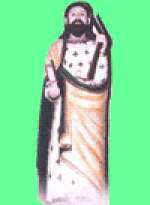
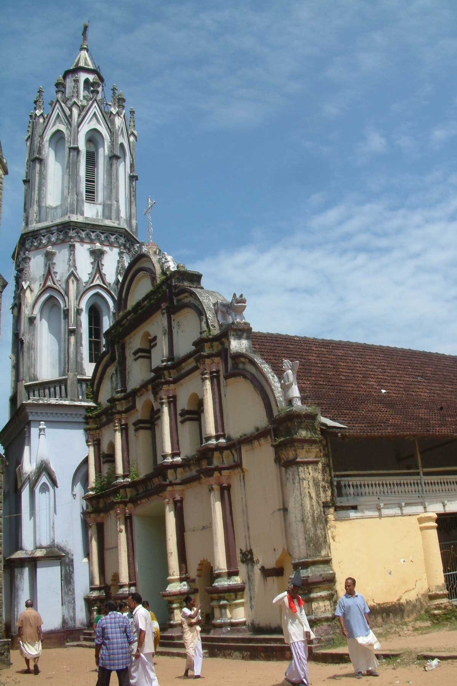
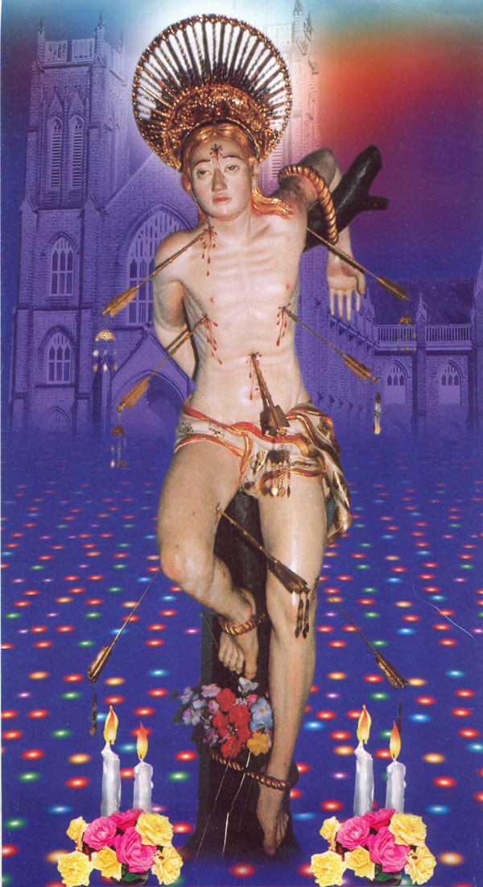
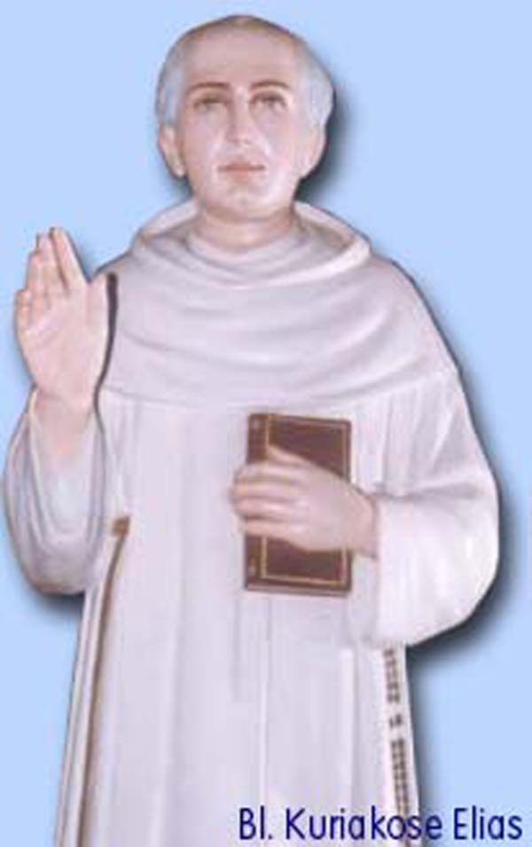

# History Part 2(History of Koilparampil (Coilparampil) Family - Part 2)

## Arthunkal and the Koilparampil Family

The origin of the name Arthunkal has been interpreted in different ways by historians.

One explanation suggests that the first Christian chapel in the area was a thatched structure built at Arthikulangara. Over time, the name is believed to have evolved from Arthikulangara to Arithikulangal and eventually to Arthunkal.

A second interpretation associates the name with the annual Arattu (ritual procession and ceremonial sea bath) conducted by the Puliankottu family's Shiva temple. The stretch of land between the temple and the seashore, where the Arattu ceremony was performed, came to be known as Arattunkal, which is believed to have gradually evolved into Arthunkal.

A third explanation, proposed by the historian Fr. Georg Schurhammer, suggests that this area was once the capital of the small kingdom of Moothedathu. According to this view, the place was originally known as Moothedathunkal, which later became Edathunkal and, in the course of time, Arthunkal.

The second church established in the present-day Cherthala Taluk is believed to have been at Manappuram (Pallippuram). In the early centuries, the St. Thomas (Marthoma/Chaldean) Christians of Arthunkal are said to have travelled there for the celebration of the Holy Qurbana and other religious services.

When St. Mary's Church, Muttom, was founded in AD 1023, the Christians of Arthunkal began attending worship there, as it was geographically closer than Pallippuram.

The history of the Muttom parish records that members of the Koilparampil family served as trustees of the church. This tradition was also reportedly confirmed by Rev. Fr. Dominic Koikara of Kanjoor during his tenure as Vicar of Muttom Parish. Likewise, Mr. Mathew M. Panat, in his book Irulile Rajatharekha, mentions that certain families of Arthunkal originally belonged to the Muttom parish.

According to family tradition, in AD 1579, after the local ruler of the Moothedathu–Elayidathu principality granted permission for the construction of churches, the forefathers of the Koilparampil family built a small thatched chapel dedicated to St. Thomas the Apostle. The chapel, which faced north, housed a Holy Cross and a statue of St. Thomas. It is believed that this same statue is now preserved in the southern altar of the present church.

In the years that followed, priests from Muttom Church regularly celebrated Sunday Mass in this chapel.

## The Early Church

Following the arrival of the Portuguese, Bishop Dom Mateus de Medina is believed to have replaced the thatched chapel with a wooden church dedicated to San Thome (St. Thomas). According to long-standing family tradition, the administration of this church was entrusted to the Koilparampil family, a responsibility remembered by successive generations.

With the establishment of Portuguese ecclesiastical authority, the local Christians gradually came under the Latin Rite. Bishop Michael Arattukulam, in his booklet St. Francis on the Malabar Coast (p.16), refers to this transition.

The construction of this early church is also mentioned in A Peep into the History of the Cochin Diocese by Fr. Joseph Naduathumuri, while Kerala Rajyathile Satyaveda Charithram by Maselenus (p.80) describes it as a structure built of timber and palm leaves.

Similarly, Rev. Fr. Paul Arackal, in his book Arthunkal Veluthachan (p.9), writes about the St. Thomas Christians of Arthunkal and their early devotion to St. Thomas the Apostle.

Although St. Francis Xavier arrived in Goa in 1542 and carried out extensive missionary work along the western coast of India, it has been suggested that he undertook little missionary activity in the region between Cochin and Purakkad, possibly because established St. Thomas Christian communities already existed there.

The Portuguese missionaries subsequently established the San Thome Mission at Arthunkal and encouraged the local St. Thomas Christians to adopt the Latin Rite.

According to available records, Fr. Fenicio constructed a stone church in 1590, and in 1640 Fr. Francisco rebuilt it with its sanctuary facing west.

## Development of Arthunkal Church

In 1647, the statue of St. Sebastian, which later became world-renowned, was installed in the church.

During the eighteenth century, the administration of the parish passed from the Jesuit Missionaries to the Carmelite Missionaries.

A notable event in the church's history occurred on 29 November 1829, when Blessed Kuriakose Elias Chavara was ordained to the priesthood by Rt. Rev. Dr. Francesco Stabili, Bishop of Verapoly, at St. Andrew's Church, Arthunkal.

From that time onward, increasing numbers of pilgrims visited Arthunkal, particularly during the annual Feast of St. Sebastian, seeking the saint's intercession and blessings.

As the number of pilgrims increased, so did the church's income. According to local tradition, disputes later arose regarding the administration of church finances by representatives of the Portuguese ecclesiastical authorities. Members of the Koilparampil, Puthenpurackal, Charankattu, and Arackal families are said to have opposed these practices, and on 15 November 1866, they built another church.

This, in brief, is the historical background of Arthunkal as it relates to the Koilparampil family.

## Author's Note

This work does not claim to be the result of an exhaustive examination of all available historical manuscripts. Rather, it is based on the historical records, published works, oral traditions, and manuscripts that were accessible to the author at the time of writing.

The author would welcome additional authentic information or documentary evidence that may help improve the accuracy of this account. Constructive corrections and supplementary material will be gratefully acknowledged and incorporated in future editions wherever appropriate.

--------

**Family Genealogy** Total live descendant families = 384

Family = **F**, Generation = **G**, Koilparampil = **K**, Tharavad (Father's home) = **T**

All first nos. is branch Number. Koilparampil Family serial nos. (Example =1.K.F,2.K.F, 3.K.F.etc)

Generation nos. (Example = G1, 2, 3, etc.)

Forefathers serial nos. = K1 to K9.

K. THOMMEN KOILPARAMPIL from Palayur, had settled at MACKEAKADAVU at MANAPURAM), Cherthala

[Branch 1](Branch_1.md): G1. 1, Chory (Settled at Elainji) (K1). 2, Anthay (K2).

[Branch 2](Branch_2.md): K1/G8.CHERIYAN (K1.Chory's descendant.) (2.K.F.1)

K2/G1 (1).ANTHEY (ANTONY) (T.K.1).

G2.1, Thommy.

K3./G2 (1) THOMMY (T.K2.)

G3.1, Vasthyan (K4).2, Vathan (3.K6.)

[Branch 3](Branch_3.md): VATHAN.(3.K6.)

G3.1, Vasthyan (K4).2, Vathan (3.K6.)

[Branch 4](Branch_4.md): K4./G3 (1) VASTHYAN (T.K3.)

K5./G4 (1) VISENTHY (T.K4.)

[Branch 5](Branch_5.md): G5.1, Ouseph (5.K8)

[Branch 6](Branch_6.md): 2, Vathy (6.K9)

