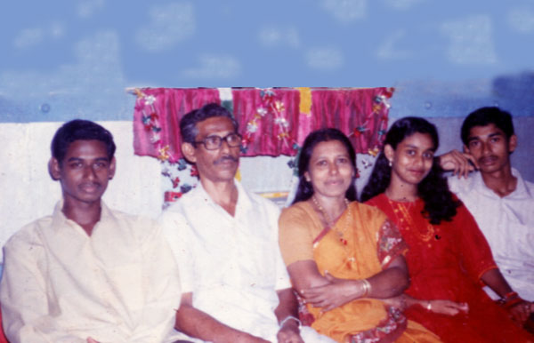

# K.A.Kochappan (son of K.S.Antony 3.K.F.254)

- Branch : [Branch 3](Branch_3.md)
- Father: [K.S.Antony](K.S.Antony_son_of_Vasthyav_Sebastin_3.K.F.28.md)
- Brothers & Sisters : [Evamma](K.J.Jacob_son_of_K.S.Joseph_3.K.F.218-2.md) , [K.A.Thankachan](K.A.Thankachan_son_of_K.S.Antony_3.K.F.254.md) , [K.A.Kochappan](K.A.Kochappan_son_of_K.S.Antony_3.K.F.254.md) , [K.A.Edison](K.A.Edison_son_of_K.S.Antony_3.K.F.254.md) , [Kusumum](Kusumum_daughter_of_K.S.Antony_3.K.F.254.md) , [K.A.Cherian](K.A.Cherian_son_of_K.S.Antony_3.K.F.254.md) , [K.A.Josey](K.A.Josey_son_of_K.S.Antony_3.K.F.254.md) , [K.A.George Kutty](K.A.George_Kutty_son_of_K.S.Antony_3.K.F.254.md)
- Childrens: Sebastian Antony , Augustine , Annie Yujin

---

## K.A.VARGHESE (Eugin Varghese/Kochappen)

 [Click On Click->](http://gallery.bizhat.com/branch-3/p220300-k-a-varghese2cnancy-kunju.html)

3.K.F. 261/G11(4). **K.A.VARGHESE (Eugin Varghese/Kochappen)**3.T.F.254 24.4.1939 Monday. Did the education at Pallithode, North Chellanam, Arthunkal and Thuravoor. After education, joined the military service, as the Radar operator and then as the Wireless operator in the anti-aircraft Regiment (at the same time took the Diploma in applied Electronics).

 [Click On Click->](http://gallery.bizhat.com/branch-3/p220301-k-a-varghese-family.html)

After the Participation in the Indo-Pak war in 1965 in 32nd independent Brigade at the Beasarea in Punjab, and returned home after getting the discharge. On 10th June 1967, got employment in Cominco Binani Zinc LTd. (now the name is Binani Industries Ltd.) and retired on 30th April 1998 and resides in the Thravad house, Arthunkal. On 29th Oct 1969 Wednesday, married **[Philomina (Nancy Kunju)](Philomina_Nancy_Kunju.md)** 15.4.1946 daughter of P.D.Bastin teacher (Kochusir) and Mary (daughter of Xavier and Thankamma, Arasarkadavil at Vadackal, Alapuzha) of Puthenpurakal, Arthunkal. Nancykunju was worked as a Hindi teacher (H.S.A.) at St.Francis Assisi H.S.S. Arthunkal and retired on 31st March 2001. Ph. 0478- 2573334, 350 4412.

G12.

1.  Sebastian Antony (Yujin Pasil K.V.)(3.K.F.262).
2.  Augustine (Yujin Boby)(3.K.F.263).
3.  Annie Yujin (Pitcy)(3.K.F.264)

 [Click On Click->](http://gallery.bizhat.com/branch-3/p220289-yujin-pasil2csmitha.html)

3.K.F.262/G12(1) SEBASTIAN ANTONY(YUJIN PASIL K.V., M.Sc.(Physics), PGDCA, UGC Lectureship)3.T.F. 261 born on 27th June 1972. After education, he got the employment in Binani industries Ltd., Binanipuram, Ernakulam. After four and half year's service, he resigned and joined as an instructor in Naval Academy at I.N.S. Shivaji, Lonavala, Pune. He married **[Smitha](Smitha.md)** MA (Hist), BEd., SET, daughter of Mr. P.E.Jose and Thressimma, Palimattom, Mookkannoor, Angmaly. Email : yp@hostonnet.com. The couple has a baby named Chris Yujin (5th Feb 2007). His hobbies include traveling, trekking, reading and photography. He has visited most of the tourist places in India and trekked at high altitude in Uttarakhand and Jammu Kashmir. You can read his Travel experience and view the Photo gallery.

 [Click On Click->](http://gallery.bizhat.com/branch-3/p220275-chris.html)

G13.

1.  Chris Yujin

 [Click On Click->](http://gallery.bizhat.com/branch-3/p220272-yujin-boby.html)

3.K.F. 263/G12(2) AUGUSTINE (Yujin Boby) B.Sc.(Physics), M.C.A.3.T.F.261 Born on 2.10.1973, Monday. He got the P.G. diploma in computer hardware, afterwards M.C.A. He is a Amateur Radio operator and his call sign is VU2PRX. Now he is managing his own software firm at Ernakulam. Ph. 0484-29 4762.

 [Click On Click->](http://gallery.bizhat.com/branch-3/p220294-steephen2cannie-yujin.html)

3.K.F.264/G12(3) ANNIE YUJIN (PITCY) MA3.T.F.261 3-11-1975 Monday. She married **[Steephen](Steephen.md)** BA, son of P.J. Antony and Mariyam kutty, Puthen house, Eddakunnu, Paduvapuram P.O.,Angamaly, Ernakulamm. Ph. 0484- 2451861 on 28 th Dec 2000 Thursday. Now she is managing her own firm [NetForHost.com](http://www.netforhost.com/). And also undertaken Matrimonial and Placement agencies. Ph : 0478 350 4412.

 [Click On Click->](http://gallery.bizhat.com/branch-3/p220295-stefin-steephan.html)

G13.

1.  [<http://stefin.bizhat.com>\| Stefin Steephan\](Antony Varghese) 19.11.2001 Monday
