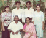
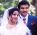
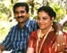
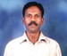
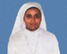

# K.A.Thankachan(son of K.S.Antony 3.K.F.254)

- Branch : [Branch 3](Branch_3.md)
- Father: [K.S.Antony](K.S.Antony_son_of_Vasthyav_Sebastin_3.K.F.28.md)
- Brothers & Sisters : [Evamma](K.J.Jacob_son_of_K.S.Joseph_3.K.F.218-2.md) , [K.A.Thankachan](K.A.Thankachan_son_of_K.S.Antony_3.K.F.254.md) , [K.A.Kochappan](K.A.Kochappan_son_of_K.S.Antony_3.K.F.254.md) , [K.A.Edison](K.A.Edison_son_of_K.S.Antony_3.K.F.254.md) , [Kusumum](Kusumum_daughter_of_K.S.Antony_3.K.F.254.md) , [K.A.Cherian](K.A.Cherian_son_of_K.S.Antony_3.K.F.254.md) , [K.A.Josey](K.A.Josey_son_of_K.S.Antony_3.K.F.254.md) , [K.A.George Kutty](K.A.George_Kutty_son_of_K.S.Antony_3.K.F.254.md)
- Childrens: K.S.Antony , Ann Mary Caroline , K.S.Joseph Victor , Sr.Helen Sophia

---

## K.A.SEBASTIN (THANKACHAN)

3.K.F.256/G11(3). **K.A.SEBASTIN (THANKACHAN)**3.T.F. 25420.1.1934 Saturday. He completed his schooling, first at Arthunkal, then at Pulimkunnu boarding school run by priests, then at Alapuzha Leo Xiii th. High school, and at North Challanam St.Sebastin H.S. He was very active scout at school. He was the first scout master there. In these days he initiated and started the open scout Troop at Pallithode. He had also received many certificates in sports at varies schools. He married **[Idamma](Idamma.md)**(28.10.1944) daughter of Victor and Baby, Anchuthykkal South Chellanam. The marriage was on 30 Th. May 1966 Monday at 4 p. m in the Arthunkal Church.They settled at Pallithode, and had five children. Ph. 98470 24990

G12.

1.  K.S.ANTONY (SURAJ) 3.K.F.257
2.  ANN Mary CAROLINE (SUJI) B.A.3.K.F.258
3.  K.S.JOSEPH VICTOR (SUNOJ)3.K.F. 259
4.  HELEN SOPHIA (Sr. SWAPNA) B.A.Suraj

3.K.F.257/G12(2) K.S.ANTONY (SURAJ) 3.T.F.256 21.6.1971 Monday after education from St.Micheles Collage Cherthala he done the Technical studies in diesel Engineering and (CAD)computer aided designs.He worked in various companies, like Cochin Mariyan corp. B.P.L.& Telco. Now he is working as a Foreman in a ship repairing dock at Dubai. He married **[Medona](Medona.md)** 1978. B.Sc;B.Ed; P.G.D.C.A.(teacher) daughter of Joy and Mary Panickaveettil, Mararikulam on 26th April 2004.

G13.

1.  SURAJ
2.  SURAJ

ANN Mary CAROLINE (SUJI) B.A.B.A. 14.1.1973 Sunday. After her education, she has worked in a Homeo research center in Ernakulam. She married **[Jino Tom Joseph](Jino_Tom_Joseph.md)** son of Joseph (Mamachan) and Annamma of Azhickal, Cherthala. The couple has two daughters.

G13.

1.  Jino
2.  Jino

[3.K.F. 259/G12(4)\| ]] K.S.JOSEPH VICTOR (SUNOJ)3.T.F. 2564-4-1975 friday. He did the electrician course at St. Joseph I.T.C.Thuravoor. He organized "Koilparampil Kuduma Yogam" at Pallithode in 1996. Now he is working as generator operator in a factory at Gujarat.

3.K.260/G12(5) HELEN SOPHIA (Sr. SWAPNA) B.A.3.T.F. 25611.4.1977 Tuesday. After her collage education she become nun in the Visitation Convent Alapuzha on 26th June 2001.
