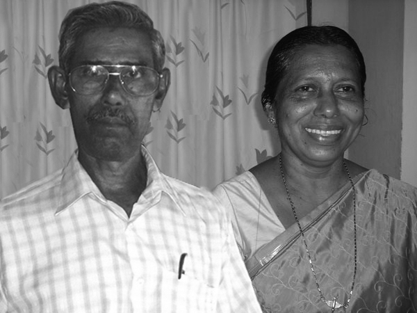
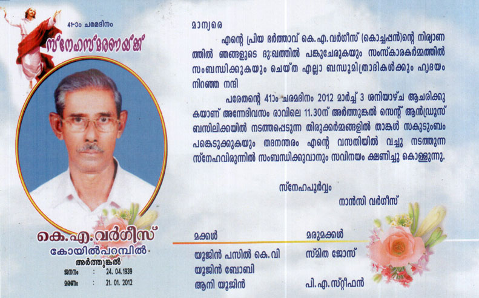
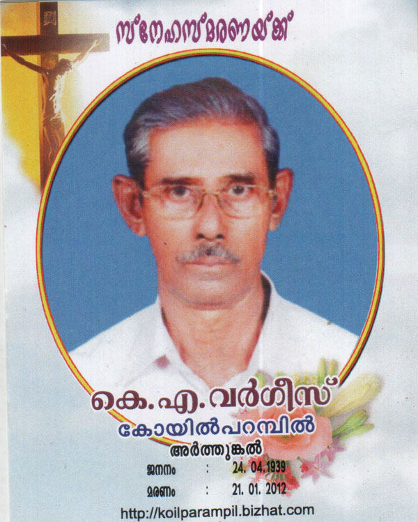

# K.A. Varghese (Eugene Varghese / Kochappan)

 [Mr.& Mrs. K.A.VARGHESE](http://gallery.bizhat.com/branch-3/p212795-k-a-varghese.html)

3.K.F. 261/G11(4). K.A.VARGHESE (Eugin Varghese/KOCHAPPEN)[3.T.F.254] 24-Apr-1939 (Monday) to 21-Jan-2012 (Saturday). Did the education at Pallithode, North Chellanam, Arthunkal and Thuravoor. After education, joined the military service, as Radar operator and then as the Wireless operator in the anti-aircraft Regiment (at the same time took the Diploma in applied Electronics). After the Participation in the Indo-Pak war in 1965 in 32nd independent Brigade at the Beas area in Punjab, and returned home after getting the discharge. On 10th June 1967, got employment in Cominco Binani Zinc Ltd (now the name is Binani Industries Ltd) and retired on 30th April 1998 and resides in the Thravad house, Arthunkal. On 29th Oct 1969 Wednesday, married Philomina (Nancykunju) 15.4.1946 daughter of P.D.Bastin teacher (Kochu sir) and Mary (daughter of Xavier and Thankamma, Arasarkadavil at Vadackal, Alappuzha) of Puthenpurakal, Arthunkal. Nancykunju was worked as a Hindi teacher (H.S.A.) at St.Francis Assisi H.S.S. Arthunkal and retired on 31st March 2001. Ph. 0478- 2573334, 350 4412.

\<youtube\>NB2LbaqEP9o\</youtube\>

## Children

G12.

1.  Yujin Pasil K.V (Sebastian Antony)(3.K.F.262].
2.  Yujin Boby (Augustine)(3.K.F.263).
3.  [Annie Steephan](Annie_Steephan.md) (Pitcy)(3.K.F.264)

3.K.F.262/G12(1) SEBASTIAN ANTONY(YUJIN PASIL K.V., M.Sc.(Physics), PGDCA, UGC Lectureship)[3.T.F. 261] born 27th June 1972. After education, he got the employment in Binani industries Ltd, Binanipuram - 683502. After four and half year's service, he resigned and joined as an instructor in Naval Academy at I.N.S. Shivaji, Lonavala - 410 402. He married Smitha MA (Hist), BEd., SET, daughter of P.E.Jose and Thressimma, Palimattom, Mookkannoor, Angmaly. The couple has a baby named Chris Yujin (5th Feb 2007). He is presently working as Inspector of Legal Metrology in Kerala. His hobbies include traveling, trekking, reading and photography. He has visited most of the tourist places in India and trekked at high altitude in Uttarakhand and Jammu Kashmir. Email : yp@bizhat.com.

G13. 1,

3.K.F. 263/G12(2) AUGUSTINE (Yujin Boby) B.Sc.(Physics), M.C.A.[3.T.F.261] Born on 2.10.1973, Monday. He got the P.G. diploma in computer hardware, afterwards M.C.A. He is a Amateur Radio operator and his call sign is VU2PRX. Now he is managing his own software firm at Ernakulam. Ph. 0484-29 4762.

3.K.F.264/G12(3) ANNIE YUJIN (PITCY) MA[3.T.F.261] 3-11-1975 Monday. She married Steephen BA, son of P.J. Antony and Mariyam kutty, Puthen house, Eddakunnu, Paduvapuram P.O.,Angamaly, Ernakulamm. Ph. 0484- 2451861 on 28 th Dec 2000 Thursday. Now she managing her own firm www.NetForHost.com . And also undertaken Matrimonial and Placement agencies. Mobile Ph : 0478-3504412.

G13. Stefin Steephan( Antony Varghese) 19.11.2001 Monday

## Death

K.A. Varghese passed away on 21-Jan-2012. The Funeral held in St. Andrews Basilica, Arthunkal on 23-Jan-2012.

The 41st day of demise on : 3-March-2012 at 11 AM

## Decidents (G.11)

[Branch 3-K.S. Antony](Branch_3-K.S._Antony.md)

1.  [K.A. Sebastin](K.A._Sebastin.md) (5th June1927-20th June 1927).
2.  Annie Evangeline (Evamma) (3.K.F.255)
3.  [K.A. Sebastin (Thankachan)](K.A._Sebastin_Thankachan.md) (3.K.F.256)
4.  [K.A. Varghese (Eugene Varghese / Kochappan)](K.A._Varghese_Eugene_Varghese_Kochappan.md) (3.K.F.257)
5.  [K.A. John Edison](K.A._John_Edison.md) (3.K.F.258)
6.  [Clara Clementine(Kusumum)](Clara_Clementine_Kusumum.md)(3.K.F.259)
7.  [K.A. Francis Cherian/Ponnappan](K.A._Francis_Cherian_Ponnappan.md) (3.K.F.260)
8.  [K.A. Joseph (Josey)](K.A._Joseph_Josey.md)(3.K.F.261)
9.  [K.A. Jacob Louis George (George kutty)](K.A._Jacob_Louis_George_George_kutty.md) (3.K.F.262)

---

[Branch 3](Branch_3.md),[Branch 3-Margarita](Branch_3-Margarita.md) , [Branch 3-Gabriel](Branch_3-Gabriel.md) , [Branch 3-Mariyamma](Branch_3-Mariyamma.md) , [Branch 3-Eleeswa](Branch_3-Eleeswa.md) , [Branch 3-Cherian](Branch_3-Cherian.md) , [Branch 3-Sr Mary Beatrice](Branch_3-Sr_Mary_Beatrice.md) , [Branch 3-Joseph](Branch_3-Joseph.md) , [Branch 3-K.S. Antony](Branch_3-K.S._Antony.md)

[Branch 1](Branch_1.md) [Branch 2](Branch_2.md) [Branch 3](Branch_3.md) [Branch 4](Branch_4.md) [Branch 5](Branch_5.md) [Branch 6](Branch_6.md)
