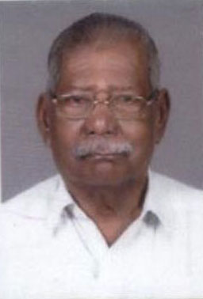
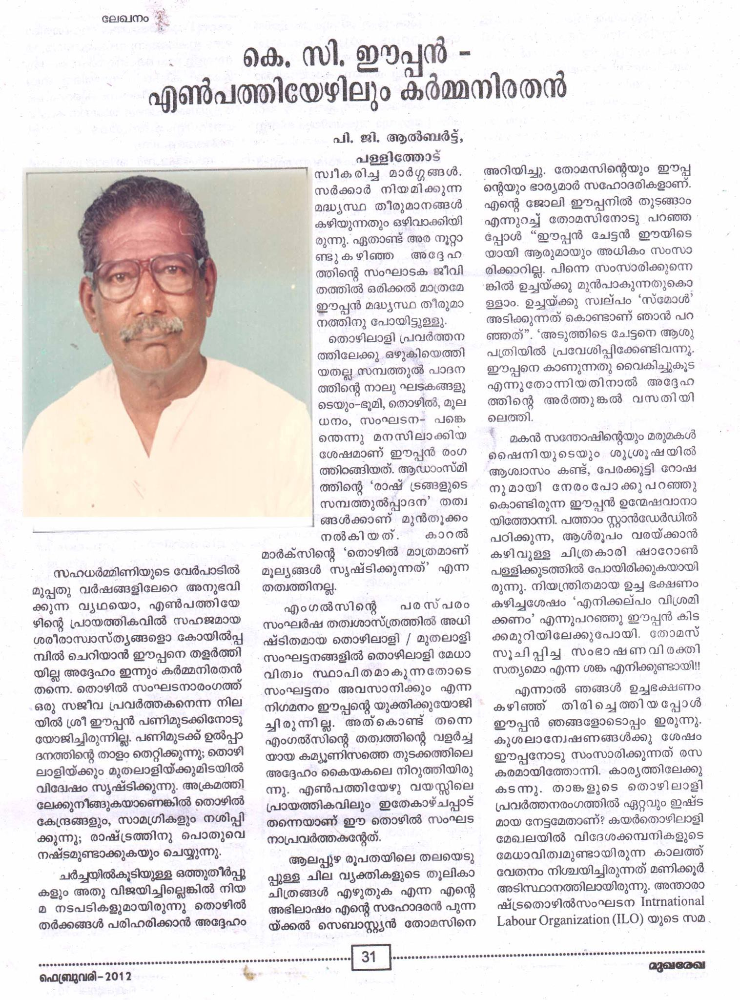
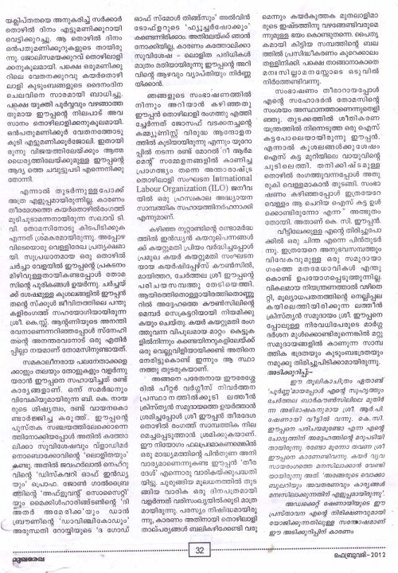
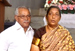
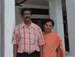

# K.C.Eapen(son of K.S.Cheriyan Mapillai 3.K.F.101)

**K.C.Eapen Passed away**

[K.C.EAPEN](<K.C.Eapen(son_of_K.S.Cheriyan_Mapillai_3.K.F.101).md>) B.A (Ex General Secretary of the Kerala INTUC) passed away on 01-Aug-2012 at 6:50 PM. He was 89. The funeral will be on 04-Aug-2012, 2:30 PM at St. Andrew's Basilica, Arthunkal. Phone: 9847176238, 9846742480, 0478-2572480.

He as an intermediate student at St.Thomas College, Thichur he was involved in the "Quit India" Movement in 1942. He got a scholar-ship under the Columbi Plan and was given training in Britain in trade unionism for a period of 3 months, after his training in UK he got a short-term scholarship for studies at the International Labour organization office at Geneva and thereafter was a guest of the Histradet (Trade Union movement of Israel). He was president of the district INTUC and thereafter general secretary of the Kerala INTUC. He also served in the Minimum wage advisory board constituted by the Government of India, where he was vice chairman for two years.

He was also active in Socio-rligious work and was a delegate from Kerala to the All India Social Service Conservation at Madras. He was Chairman of the workshop on labour in the Lay Aposthaklete Conference of Malabar held at Aluva as well as at the All India Lay Aposthalete Conference at Rome. He also served as Secretary of the Malabar Catholic social service sponsored by the Bishop's conference of Kerala as well as President of the coastal social Service Society organized by the Later Bishop Dr.Michael Arattukulam. He also had the rare opportunity of a private visit to His Holiness: Pop.John Paul, as a trade unionist.

At present he is secretary of the Coir shipper's council, the premier organization of Coir exporters of Kerala. He is also a member of the Coir industrial relations council constructed by the Government of Kerala .

---

- Branch : [Branch 3](Branch_3.md)
- Father: [K.S.Chearian](<K.S.Chearian(son_of_Vasthyan_(Sebastin)_3.K.F.28).md>)
- Brothers & Sisters : [K.C.Chinnappan](<K.C.Paul(son_of_K.S.Cheriyan_Mapillai_3.K.F.101).md>) , [K.C.Kunjukunju](<K.C.Kunjukunju(son_of_K.S.Cheriyan_Mapillai_3.K.F.101).md>) , PONNAMMA , EAPACHAN , [K.C.Pappy](<K.C.Pappy(son_of_K.S.Cheriyan_Mapillai_3.K.F.101).md>) , [Kunjannamma](<Kunjannamma(son_of_K.S.Cheriyan_Mapillai_3.K.F.101).md>) , [K.C.Eapen](<K.C.Eapen(son_of_K.S.Cheriyan_Mapillai_3.K.F.101).md>) , [K.C.Ponnappan](<K.C.Ponnappan(son_of_K.S.Cheriyan_Mapillai_3.K.F.101).md>) , Rev.Sr.LAURA , Sr. BEATRICE , [K.C.Ummachan](<K.C.Ummachan(son_of_K.S.Cheriyan_Mapillai_3.K.F.101).md>)
- Childrens : Annie Rita , Mary Margret , George , Mariyamma , Thomachan , Thomas , Santhosh , Sebastin , Beatrice

---

## K.C.EAPEN

 [Click On Click->](http://gallery.bizhat.com/branch-3/p219873-k-c-eapen-2cyavadosya.html)

3.K.F. 199/G11(7)**K.C.EAPEN** B.A.3.T.F.182 13-3-1924 After completing his primary education at Arthunkal, he had his highersecondary studies at Alocious high school, Elthuruth. He passed S.S.L.C. with 2nd.Rank in history (Optional) in the state of Cochi. During his high school studies he was also the winner of the "Medlicott" gold medal for religious education from Diocese of Trichur. While an intermediate student at St.Thomas College, Thichur he was involved in the "Quit India" Movement in 1942. As President of the Student National Organization, the first non-communist student organization of India. He was arrested and imprisoned along with Sarvasree Panampally SreedharaMenon, Achuthamenon and K.Karunakaran among other leaders after independence he resumed his studies and graduated, and thereafter Headmaster of the St.Rafel's school, Ezhupunna. Resigning his job in 1952 he joined the Trade union movement as a full-timer of the INTUC, working from Alleppey. He was also active in Socio-rligious work and was a delegate from Kerala to the All India Social Service Conservation at Madras. He was Chairman of the workshop on labour in the Lay Aposthaklete Conference of Malabar held at alwaye as well as at the All India Lay Aposthalete Conference at Rome. He also served as Secretary of the Malabar Catholic social service sponsored by the Bishop's conference of Kerala as well as President of the coastal social Service Society organized by the Later Bishop Dr.Michael Arattukulam. He was also a delegate from India in the Seminar for Labour Leadership held at Hongkong. There he got a scholar-ship under the Columbi Plan and was given training in Britain in trade unionism for a period of 3 months, after his training in UK he got a short-term scholarship for studies at the International Labour organization office at Geneva and thereafter was a guest of the Histradet (Trade Union movement of Israel) for a period if one week, He also had the rare opportunity of a private visit to His Holiness: Pop.John Paul, as a trade unionist. He was President of most of the trade unions affiliated to the INTUC in the town of Alleppey. He was president of the district INTUC and thereafter-general secretary of the Kerala INTUC. He also served in the Minimum wage advisory board constituted by the government of India, where he was vice chairman for two years. At present he is secretary of the Coir shipper's council, the premier organization of Coir exporters of Kerala. He is also a member of the Coir industrial relations council constructed by the Government of Kerala .

Mr.&Mrs.Eapen He married Yavadosya (Kochamma)daughter of Raphel Thomas and Agnus, Kurishinkal (Muvattumuppinkal) Chnnaveli.The marriage was on 9-6-1948. Nine of springs were born to them.

G12.

1.  Annie Rita. (Shanta)(3.K.F.200).
2.  Mary Margret(Shobha) (3.K.F.201).
3.  George(Cheriyachan)(3.K.F.202).
4.  Mariyamma (Valsa)(3.K.F.203).
5.  Thomachan 3-5-1958 to 14-5-1960.
6.  Thomas (Kunjumon)(3.K.F.204).
7.  Santhosh(3.K.F.205).
8.  Sebastin (Gussy) (3.K.F.206)
9.  Beatrice (Sneha )(3.K.F.207).

 [Click On Click->](http://gallery.bizhat.com/branch-3/p219932-v-m-francis-2cannie-rita.html)

3.K.F.200/G12(1) SHANTA (ANNIE RITA)B.A.3.T.F.199 29.1.1950 married V.M.Francis M.A.(Lit). 26-7-1941,son of Michael and Cicily Valiyaveettil Vypin. The marriage was on 18-12-1972. They reside at Vypin. He worked as the editorial staff of the English news paper 'Indian Communicator' for along time. Address :- Mr.V.M.FRANCIS,Valiyaveettil house,Vypen P.O., Cochin -10.

 [Click On Click->](http://gallery.bizhat.com/branch-3/p219870-michael-augustus-2cciciliya-marey-yavadosya.html)

G13.

1.  Michael Augustus (Jem) 21-8-1974.
2.  Ciciliya MareyYavadosya (Sesma)21-12-81.

 [Click On Click->](http://gallery.bizhat.com/branch-3/p219871-mr26amp-3b-mrs-jem.html)

Michael Augustus(Jem)21-8-1974. Married

 [Click On Click->](http://gallery.bizhat.com/branch-3/p220034-lal-chinnappan-2cshobha.html)

SHOBHA (MARY MARGRET)3.T.F.199 16-8-1952 married Lal Chinnappan son of Chinnappan , Kurishunkal, Arithunkal He works as sales manager of D.C.M.company for a long time,now ne is working in a Korian Company named "New era" Sobha Lal,17/8; 3rd Flore, Ali Askhar Road Cross Off Cunningham Road; Bangalore 52,Ph. 09342242897, E- mail-sobhalal@rediffmail.com

 [Click On Click->](http://gallery.bizhat.com/branch-3/p219838-marey-deepa-2cmarey-grace-deepthi.html)

G13.

1.  Marey Deepa 12-4-1975.
2.  Marey Grace Deepthi 1977.

 [Click On Click->](http://gallery.bizhat.com/branch-3/p220026-cheriyachan2c-sosamma.html)

3.K.F.202/G12(3). CHERIYACHAN(GEORGE)B.Sc.3.T.F.19920-4-1954. Married Sosamma B.A., B.Ed. daughter of Kujachan and Baby, Arackal Chethy the marriage was on 9-11-1980. He works as export division manager in 'Rajashekhar textiles Coimbatore . Shoshamma is a teacher in Perks higher secondary school Coimbatore.

G13.

1.  Augustine Antony (Ashly Cheriyan) 2-1-1982.

 [Click On Click->](http://gallery.bizhat.com/branch-3/p220024-mr26amp-3b-mrsashly-cheriyan.html)

Augustine Antony (Ashly Cheriyan) 2-1-1982.

 [Click On Click->](http://gallery.bizhat.com/branch-3/p219840-higgin-percy-thomas-2cvalsa.html)

VALSA(MARIYAM)B.Sc. (homescience) 3.T.F.199 16-4-1956.Married to Higgin Percy Thomas B.Com. son of Benedict and Janet, Charankatt, Muvattupuzha , the marriage was on 6-5-1984.He was accountant in Saudi Arabia.Now he is in "Music World"at Ernakulam. Valsa is working as dietitian in K.V.M.Hospital Cherthala.

 [Click On Click->](http://gallery.bizhat.com/branch-3/p219929-savna.html)

G 13.

1.  Savna Josephine (Savna).
2.  Benedict Thomas (Ben)

3.K.F.204/G12(6). THOMAS (KUNJUMON) B.A.20-8-1960After his studies he worked for a while as teacher in Bhutan. Now he works in India tourism and travel corporation .He married Sophy B.Com.,daughter of Joseph and Celine, Pandialackal Cochin India. Address :- Thomas Eapen, tourism and travel corporation,118/120 Jemkar street, near J.J.Hospital Jn.Bombay 400 008.

G 13.

1.  Augustine Savio (Joseph Savio).
2.  Saniyo

 [Click On Click->](http://gallery.bizhat.com/branch-3/p219928-santhosh-2cmary-magdelene.html)

SANTHOSH 17-5-1962.3.T.F.199.After his general education, he took Electronics H.I.E.T.diploma. He worked for a short time in Electronics servicing unit, then he went to Saudi Arabia. In 1996 he married Mary Magdelene (Shiny) daughtar of O.S Gomas and Tresa, Ulliyakovil,Kadappakada Quilon.Ph. 0478 257 3541

 [Click On Click->](http://gallery.bizhat.com/branch-3/p219831-ammu-santhosh.html)

G13.

1.  Sharon(Ammu)12 th.March 1996
2.  at 2330hrs.

 [Click On Click->](http://gallery.bizhat.com/branch-3/p219839-k-e-sebastin-2cjessy.html)

3.K.F.206/G12(8). SEBASTIN (GUSSY)3.T.F.199 16-5-1964.After educatione he worked about two year in Saudi Arabia and married Jessy, 16-8-1964,daughter of Kurian and Annamma, Kothamana, Olathala,Vayelar, Cherthala, She was working as a nurse in Saudi Arabia. Now both of them reside with father. He is managing the Cable T.V.service at ArithunkalPh.0478 257 2480.

 [Click On Click->](http://gallery.bizhat.com/branch-3/p219912-kevin2ckein.html)

G13.

1.  Kevin 17-8-1996 he was born in Saudi Arabia.
2.  Adrie Sebastin 5 th.Nov.1999.

 [Click On Click->](http://gallery.bizhat.com/branch-3/p219934-sneha-george.html)

3.K.F.207/G12(9) SNEHA 3.T.F.199 21-12-1965.Married George Rosario son of Mariyanto and Mary, Rosario-Villa, Kozhimukku, Edacochin He is the proprie tor of St.Juds Engineering workshop,near K.S.R.T.C bus stand .

 [Click On Click->](http://gallery.bizhat.com/branch-3/p219832-angel-marey-2cann-evan.html)

G13.

1.  Angel Marey(Angela) 24-4-1994.
2.  Ann Evan 22-5-1995.
3.  George.
