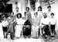
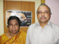

# K.C.Paul(son of K.S.Cheriyan Mapillai 3.K.F.101)

- Branch : [Branch 3](Branch_3.md)
- Father : [K.S.Chearian](<K.S.Chearian(son_of_Vasthyan_(Sebastin)_3.K.F.28).md>)
- Brothers & Sisters : [K.C.Chinnappan](<K.C.Paul(son_of_K.S.Cheriyan_Mapillai_3.K.F.101).md>) , [K.C.Kunjukunju](<K.C.Kunjukunju(son_of_K.S.Cheriyan_Mapillai_3.K.F.101).md>) , PONNAMMA , EAPACHAN , [K.C.Pappy](<K.C.Pappy(son_of_K.S.Cheriyan_Mapillai_3.K.F.101).md>) , [Kunjannamma](<Kunjannamma(son_of_K.S.Cheriyan_Mapillai_3.K.F.101).md>) , [K.C.Eapen](<K.C.Eapen(son_of_K.S.Cheriyan_Mapillai_3.K.F.101).md>) , [K.C.Ponnappan](<K.C.Ponnappan(son_of_K.S.Cheriyan_Mapillai_3.K.F.101).md>) , Rev.Sr.LAURA , Sr. BEATRICE , [K.C.Ummachan](<K.C.Ummachan(son_of_K.S.Cheriyan_Mapillai_3.K.F.101).md>)
- Childrens : Margarine , Adele , Betsy , Cherry

---

## K.C.PAUL

 [Click On Click->](http://gallery.bizhat.com/branch-3/p219872-k-c-chinnappan-2cflossy.html)

3.K.F.183/G11(1).**Prof. K.C.PAUL (CHINNAPPAN)** M.A.Lit. 3.T.F.182 24.12.1910 -25.12.1992.His education started at St.Francis Assisi Lower Primarey and English middle schools Arthunkal, Cherthala, where he learned much more than English alphabet and basic words in English, the St.Marey's English high school. Alwaye, which gave him a solid foundation in English grammar and usage, the St.Berchman's College, Changanacherry, where, as an undergraduate, he studied Mathematics, Physic and Chemistry and won a first prize in an English Extempore speech competition and another for apologetics and Christyan Doctrine, the St.Thomas College, Trichur, at which he graduated in Economics, Political Science an history, and got a first prize for the article in English published in the college magazine, and finally, the Presidency college, Madras,Tamilnadu, from where he Post-graduated in English language and Literature providentially, not without distinction. After the education he joined as an Assistant master at St.Philomenas English high school, Mysore, Karnadaka state. Then he joined as lecture in English at Venkatagiri Rajah's college, Nellore Andhra Pradesh.after Nellore service he joined as head of the department of English, Voorhees College, Vellore,Tamilnadu, at last he joined as professor and head of department of English Cotholicate college, Pathonamthitta Kerala state. He h serve in all the four states of South

He married Flossy B.A.of Mangalore. they had a son and Three daughters after his retirement He reside at Cherry blossom, 17, Collage road, Vellore 6, Tamilnadu.He published his "My days in Voorhees"in 1966 and "The Moaning of the dove"in 1973.On Dec. 25Th 1992, he died at the of age 82.

 [Click On Click->](http://gallery.bizhat.com/branch-3/p219837-k-c-chinnappan-family.html)

G12.

1.  Margarine(Maggy)(3.K.F.184).
2.  Adele(3.K.F.185).
3.  Betsy (3.K.F.186).
4.  Cherry (3.K.F.187).

MARGARINE(MAJY) B.Sc. 3.T.F.183 1952 married J.A. Louise. Address:- J.A.Louise No.124, Brindavan Extension, Mysore-670 020 Ph. 082-151 3065.

G13.

1.  Charley.
2.  Conney.
3.  Claudy.

ADELINE M.A.3.T.F.183 1954.Married James, Eeroad, Tamilnadu. He is employed in the railway.

G.13.

1.  Annie.
2.  Alphy.

 [Click On Click->](http://gallery.bizhat.com/branch-3/p220021-alexander2c-betsy.html)

Prof. BETSY M.Sc.(Mathematic) 3.T.F.183 1956.She is a Professor at Holy Cross College, Thrichirappally, Tamilnadu.She married V.C.Baby,son of Chacko and Hessyamma, Vettikappillil, (Kavikkunnel) Pala. Address:- V.C.Baby, A-16, Jai-nagger, Thiruverumber, Trichy Pin.620013, Ph.0431- 251 3824.

 [Click On Click->](http://gallery.bizhat.com/branch-3/p220029-jacob-alexander-2cjoseph-alexander.html)

G12

1.  Jacob Alexander
2.  Joseph Alexander

 [Click On Click->](http://gallery.bizhat.com/branch-3/p219836-k-c-cherry.html)

3.K.F.187/G12(4) CHERRY 3.T.F.183 M.Com.1958
