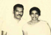

# K.C.Ponnappan(son of K.S.Cheriyan Mapillai 3.K.F.101)

- Branch : [Branch 3](Branch_3.md)
- Father : [K.S.Chearian](K.S.Chearian_son_of_Vasthyan_Sebastin_3.K.F.28-2.md)
- Brothers & Sisters : [K.C.Chinnappan](K.C.Paul_son_of_K.S.Cheriyan_Mapillai_3.K.F.101-2.md) , [K.C.Kunjukunju](K.C.Kunjukunju_son_of_K.S.Cheriyan_Mapillai_3.K.F.101.md) , PONNAMMA , EAPACHAN , [K.C.Pappy](K.C.Pappy_son_of_K.S.Cheriyan_Mapillai_3.K.F.101-2.md) , [Kunjannamma](Kunjannamma_son_of_K.S.Cheriyan_Mapillai_3.K.F.101-2.md) , [K.C.Eapen](K.C.Eapen_son_of_K.S.Cheriyan_Mapillai_3.K.F.101-2.md) , [K.C.Ponnappan](K.C.Ponnappan_son_of_K.S.Cheriyan_Mapillai_3.K.F.101-2.md) , Rev.Sr.LAURA , Sr. BEATRICE , [K.C.Ummachan](K.C.Ummachan_son_of_K.S.Cheriyan_Mapillai_3.K.F.101-2.md)
- Childrens : Pradeep

---

## K.C.VARGHESE(PONNAPPAN)

 [Click On Click->](http://gallery.bizhat.com/branch-3/p219876-k-c-ponnappan-2c-vavamma.html)

3.K.F.208/G11(6). **PONNAPPAN(K.C.VARGHESE)**B.Sc.He had his primary schooling at Arithunkal , high school education was at Sacred heart high school Thevara, his collage education was from St.Philomena's at Mysore. First he worked as chemist at Vellore for a short period. He married Vavamma (Emelda) 29-6-1939.T.T.C., daughter of Laser Fernandez and Mary Fernandez, Kalladi, Pallithura, Kazhakoottam,Thiruvananthapuram.She worked as a teacher at Arithunkal and retired as head mistess from Chennaveli school. They had no children so they adopted,brother's child,(son of K.C.Ummachan and Kusumum.)(3.K.F.212).

G12.

1.  Pradeep (Joseph Cheriyan) 27.2.1963.

 [Click On Click->](http://gallery.bizhat.com/branch-3/p219915-pradeep-2crosamma.html)

PRADEEP(JOSEPH CHERIYAN)3.T.F.208 (27.2.1963--14.4.1999 wednesday 0135 hrs.) After his collage studies, he was conducting a travel service. He married Rosamma (Susy) B.Sc. daughter of Joseph and Annamma Velikkakathu, Pallipuram. Cherthala. the marriage was on 3-9-1989. Pradeep was seriously injured in bus accident on 7-4-1999 at Navayikulam after a weeks struggling between life and death he succumbed to God's will.

 [Click On Click->](http://gallery.bizhat.com/branch-3/p219833-emal-rose2cgeorge-thomas.html)

G13.

1.  Emal Rose (Annu Rose.P)18-11-1990.
2.  George Thomas (Ajay Joseph.K) 29-5-1995.
