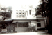

# K.C.Ummachan(son of K.S.Cheriyan Mapillai 3.K.F.101)

- Branch : [Branch 3](Branch_3.md)
- Father : [K.S.Chearian](K.S.Chearian_son_of_Vasthyan_Sebastin_3.K.F.28-2.md)
- Brothers & Sisters : [K.C.Chinnappan](K.C.Paul_son_of_K.S.Cheriyan_Mapillai_3.K.F.101-2.md) , [K.C.Kunjukunju](K.C.Kunjukunju_son_of_K.S.Cheriyan_Mapillai_3.K.F.101.md) , PONNAMMA , EAPACHAN , [K.C.Pappy](K.C.Pappy_son_of_K.S.Cheriyan_Mapillai_3.K.F.101-2.md) , [Kunjannamma](Kunjannamma_son_of_K.S.Cheriyan_Mapillai_3.K.F.101-2.md) , [K.C.Eapen](K.C.Eapen_son_of_K.S.Cheriyan_Mapillai_3.K.F.101-2.md) , [K.C.Ponnappan](K.C.Ponnappan_son_of_K.S.Cheriyan_Mapillai_3.K.F.101-2.md) , Rev.Sr.LAURA , Sr. BEATRICE , [K.C.Ummachan](K.C.Ummachan_son_of_K.S.Cheriyan_Mapillai_3.K.F.101-2.md)
- Childrens : Pradeep , Marey Beatrice , Leatishia , Joseph Sebastin Aneclete , Thomas Thadevus

---

## K.C.THOMAS(UOMMACHAN)

3.K.F.212/G11(9)**UOMMACHAN(3.K.C.THOMAS)**3.T.F.182 (8.9.1934-29.10.1989). After his schooling at Arithunkal he under took photography as his profession. He married Rose Delima (Kusumum) B.Sc.B.Ed. daughter of Augustine Aneclete and Kunjamma, Kurishinkal Chavara,Kollam who were formerly residing at Kochi.

They have Three sons and two daughters.K.C.Ummachan was a born sculptur. He erected several artistic models in plaster of paris and in cement and won Everybody's approval at the age of fifty five he died of high blood pressure. Kusumum was high school teacher and Later became head mistess. After her retirement she spends her time in social service and building up morel values Ph.0478 257 22 86

G12.

1.  Joseph Cheriyan(Pradeep)(3.K.F.209).
2.  Marey Beatrice(Leatha) (3.K.F.213).
3.  Leatishia(Lekha)(3.K.F.214).
4.  Joseph Sebastin Aneclete (Sudeep)(3.K.F.215).
5.  Thomas Thadevus (Jayadeep)(3.K.F.216).

3.K.F.213/G12(2) MARY BEATRICE(LEATHA)B.Sc. 3.T.F.212 1-8-1964. Married to Joseph, son of P.B.Sebastin and Vijayamma, Puthenpurckal, the marriage was on 8-5-1988. Now the whole family reside at Bangalore. Joseph works as civil contractor at Bangalore.

G13.

1.  Don 2.5.1990.
2.  Denny 24.10.1992.

3.K.F.214/G12(3) LEKHA (LETISHIA)B.Sc.B.Ed.3.T.F.212 28.9.1966.Married K.R.Antony B.Sc. Son of Raphel and Anna, Kalathil Vaduthala, Ernakulam.both of them migrated to U. S. A.Ph. 001 63 06 45 43 00

G.13.

1.  Brian Antony Kalathiveettle. 28-2-1999.

3.K.F.215/G12(4). JOSEPH SEBASTIN ANECLETE(SUDEEP)3.T.F.212. After his studies, he got training in photography from his father, after the death of his father he took charge the photo studio, inaddition to he handles Vediography, Photostate and Photo-laminlation. He married Resmi.B.Sc.B.Ed.(teacher) 25-9-1974 daughter of P.R.J.M.Das and Alphonsa, Puthenpurackal, Kalavoor.

G.13.

1.  Calwin Sudeep 5-3-1999.

3.K.F.216/G12(5). JAIDEEP OOMMEN(THOMAS THEDEVUS)3.T.F.2127-8-1976. He is working in M/s.Max Power Project Address :-113/B,Arjun Nagar,Safdarjung Enclave, New Delhi. He married Sunija B.Com., daughter of P.A. Kunjappu and Mary James (H.S.A.) of Pareakattil, Arthunkal P.O.,Cherthala.Ph. :-(O)616 2172, (R) 616 1014.G.13.1, .

G.13.

1.  JAIDEEP.
