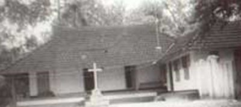
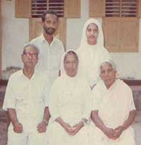
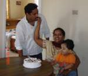

# K.C. Antony(son of Cheriyan 2.K.F.1)

- Branch : [Branch 2](Branch_2.md)
- Father : Cheriyan
- Brothers & Sisters :[K.C. Ouseph](<K.C._Ouseph(son_of_Cheriyan_2.K.F.1).md>) , [K.C.Pyely](<K.C.Pyely(son_of_Cheriyan_2.K.F.1).md>) , [K.C.Cheriyan](<K.C.Cheriyan(son_of_Cheriyan_2.K.F.1).md>) , [K.C. Varkey](<K.C._Varkey(son_of_Cheriyan_2.K.F.1).md>) , [K.C. Antony](<K.C._Antony(son_of_Cheriyan_2.K.F.1).md>) , Mary
- Childrens : Cheriyan , Kathareena , Thresya , Ealy

---

## K.C. ANTONY (KUNJU KUNJU)

 [K.C.Antony House](http://gallery.bizhat.com/)

2.K.F.108/G9(5)**K.C. ANTONY (KUNJU KUNJU)** [2.T.F.1] he lived in the "Tharavad" home at Mackekadavu.

G.10.

1.  Cheriyan 1910 (2.K.F.109).
2.  Kathareena 1912(2.K.F.122)
3.  Thresya (2.K.F.124) 1914(2.K.F.123).
4.  Ealy 1916 (2.K.F.124).

 [K.A.Cheriyan Family](http://gallery.bizhat.com/)

2.K.F.109/G10(1)K.A.CHERIYAN 1910--30.9.1999 [2.T.F.108] married Rosamma 1920--30.4.1998. daughter of Varkey Manimala, Kulasekharamangalam, Vaikom.

G.11.

1.  Kunjamma 1940 (2.K 110).
2.  Therasya Cheriyan 1942 (2.K.F.111).
3.  Antony Cheriyan 1944 (2.K.F.112).
4.  Kathrykutty 1946(2.K.F.113).
5.  Babychan (Joseph) 1948 (2.K.F.114).
6.  Mary-kunju 1950 (2.K.F.115).
7.  Elzamma 1952(2.K.F.116).
8.  Rosely1954(2.K.F.117).
9.  Alphonsa 1956 (2.K.F.118).
10. K.C.George 1958(2.K.F.119).
11. Cheriyan 1960(2.K.F.120).
12. Paul Cheriyan 1962(2.K.F.121).

2.K.110/G11(1)Sr. KUNJAMMA(WELLY JES)1940[2.T.F. 109]St.ANN's convent Trichy.

2.K.F.111/G11(2)THRESYA CHERIYAN 1942 [2.T.F. 109] She is married to Joseph son of George Mappillaparambil.Vadayar, Vaikom

G.12.

1.  Biju,
2.  Raju,
3.  Saju (1971) and
4.  Thomas Elias Maju (1973).

 [Mr.& Mrs.Saju Joseph](http://gallery.bizhat.com/)

2.K.F.111/G12(3) SAJU JOSEPH 1971 (Regional Manager (DPC)E.I.Dupont India Pvt.Ltd) (2.T.F.111)married to Deepa Kurian daughter of P.C.Kurian and Celine Kurian. Ph. <Res:044> 55440622 Mob:91 9380571258. saju_joseph1@yahoo.com

G.13.

1.  Samrudhi Elizabeth who is 3 and half(2002).

2.K.F.112/G11(3). Dr.K.C. ANTONY CHERIYAN M.B.B.S 1944 .[2.T.F. 109] married Celine,Elanji, he is managing "The Santhi Clinic" at Edappally. Ph.0484 -234 5868

G.12.

1.  Pradeep 1975 M.B.A.
2.  Prasanth 1977 B.D.S.
3.  Preya 1979 M.Sc.

2.K.F.113/G11(4) KATHRYKUTTY 1946 [2.T.F. 109] married Joseph, son of Manuel Puliyapally, Kuthattukulam.

G.12.

1.  Joho 1969.
2.  Joley 1971.
3.  Joshy1973.
4.  Joby1975.
5.  Jeothy 1977.

2.K.F.114/G11(5).K.C. BABYCHAN (K.C.JOSEPH) 1948 B.E. (Civil) [2.T.F. 109] (Tvm.Eng.College) He married Mariyamma, daughter of Antony Nadackal Trivandrum.Ph. 0471-244 7283.

G.12.

1.  Nisha 1981 B.E.
2.  Nethish 1983.

2.K.F.115/G11(6)MARY-KUNJU (K.C.MARY)1950 [2.T.F.109] married M.M.Joseph ,Chellythara Vaikom.

G.12.

1.  Umesh B.E.1980.
2.  Makesh B.Com. 1981.

2.K.116/G11(7)Sr. ELZAMMA 1952 [2.T.F.109] (Sr.ROJER) Medical Sisters of St.Joseph Convent Aluva.

2.K.F.117/G11(8)ROSELY 1954 [2.T.F.109] married Peter (Babychan), Vattathara Vaykom.

G.12.

1.  Robin 1985.
2.  Renu 1987.

2.K.F.118/G11(9) ALPHONSA 1956 [2.T.F.109] married Syriac 1950--1990 Pyanimundakathil, Pala.

G.12.

1.  Cardin 1987.
2.  Merlin 1989.

2.K.F.118.A/G11(9) After the death of her[2.T.F.109] husband she remarried Adv.Joseph Trissur.

2.K.F.119/G11(10). K.C.GEORGE B.A. 1958 [2.T.F.109] married Lisey 1963 M.Sc. (Course completed), daughter of K.P.Varghese and Ealykutty Kanjarathinkal,Malayil, Kadappakada Quilon (formerly at Alleppy). Manappuram ph. 0478-253 2226 Ph. 0478-253 3568

G.12.

1.  Arun 17.11.1991.
2.  Anitha 28.7.1993.

2.K.F.120/G11(11) CHERIYAN K.CHERIYAN 1960 [2.T.F.109]married Preethy M.Com., P.G.D.C.A., daughter of Augustin Cheerakathil, Muzhikulam. He is employed in Singapore.

G.12.

1.  Vivek 1994.
2.  Vinaya 1997.

2.K.F.121/G11(12).K.C.PAUL CHERIYAN B.Com.1962 [2.T.F.109] Computer operator in Kuwait.

2.K.F.122/G10(2)KATHREENA 1912 [2.T.F.108]

G.11.

1.  No details available.

2.K.F.123/G10(3)THRESYA 1914 [2.T.F.108]

G.11.

1.  No details available.

2.K.F.124/G10(4)EALY 1916 [2.T.F.108]

G.11.

1.  No details available.
