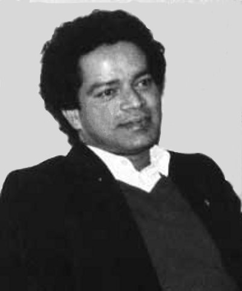

# K.C. Ouseph(son of CHERIYAN 2.K.F.1)

- [Branch 2](Branch_2.md)

[K.C. Ouseph](K.C._Ouseph_son_of_CHERIYAN_2.K.F.1.md) , [K.O.Varkey(Varghese)](Varkey_son_of_K.C.Ouseph.md) , [Poulose](Poulose_son_of_2.K.F.3_K.O.Ceriyan.md) , [Mariyam](Mariyam_son_of_2.K.F.3_K.O.Ceriyan.md) , [K.C.Pyely](K.C.Pyely_son_of_CHERIYAN_2.K.F.1.md) , [Kuruvila](Kuruvila_son_of_K.C.PYELY_2.K.F.39.md) , [K.C.Cheriyan](K.C.Cheriyan_son_of_CHERIYAN_2.K.F.1.md) , [Varghese](Varghese_son_of_2.K.F.58_K.C.Pappu_Cheriyan.md) , [Cheriyan](Cheriyan_son_of_2.K.F.58_K.C.Pappu_Cheriyan.md) , [Jose](Jose_son_of_2.K.F.58_K.C.Pappu_Cheriyan.md) , [K.C. Varkey](K.C._Varkey_son_of_CHERIYAN_2.K.F.1.md) , [K.V.Cheriyan](Cheriyan_son_of_2.K.F.83_K.C.Varkey.md) , [K.V.Joseph](Joseph_son_of_2.K.F.83_K.C.Varkey.md) , [K.C. Antony](K.C._Antony_son_of_CHERIYAN_2.K.F.1.md)

---

## K. C. OUSEPH

2.K.F.2/G9 (1)**K.C.OUSEPH** 1862-1939 July 12th. [2.T.F.1]

G.10.

1.  K.O.Cheriyan (2.K.F.3).
2.  [K.O.Varkey(Varghese)](Varkey_son_of_K.C.Ouseph.md)(2.K.F.27).
3.  K.O.Abraham(died in childhood).

2.K.F.3/G10(1).K.O.CHERIYAN 1892-1964[2.T.F.2] married Anna daughter of Poulose, Madathiparampil from Vaikom. This family settled at Manappuram P.O. Cherthala.

G.11.

1.  Joseph/Ouseph (Vava) 1917 (2.K.F.4).
2.  [Poulose](Poulose_son_of_2.K.F.3_K.O.Ceriyan.md) 1919 (2.K.F.11).
3.  [Mariyam](Mariyam_son_of_2.K.F.3_K.O.Ceriyan.md) 1921 (2.K.F.18).
4.  Antony(Anthochan)1923(2.K.25).
5.  Kunju-Annamma (Sr.Alies-Flora) 1925 (2.K.F.26).

2.K.F.4/G11(1). K.C.JOSEPH (OUSEPH/Vava) 1915-1995 School Clark. [2.T.F.3] married Ealykutty from Chambakara at Thrippunithara. This family settled at Vattathara, Manappuram P.O., Cherthala. Ph. 0478 253 2684.

G.12.

1.  Chinnamma1940 (2.K.F.5).
2.  K. J. Cheriyan 1942 (2.K.F.6)
3.  K. J.Joseph 1946(Rev.Fr.Joseph Vattapara C.M.I.) (2.K.8).
4.  K.O.Joy (Anthochan/Antony) 1950 (2.K.F.9).
5.  K.J., George Joseph 1956(2.K.F.10).

2.K.F.5/G12(1).CHINNAMMA 1940 [2.T.F.4] married Thomas son of Varkey and Mariyamma Katteath, Parayacad Chemmanathukara at Vaikom.

G13.

1.  Saly(Sr.Grace) 1968.
2.  Joseph (Baby) 1970.

2.K.F.6/G12(2).K.J.CHERIYAN 1942-25.6.1976 [2.T.F.4] married Elizabeth, daughter of Chacochan and Annamma Naduthalamuriyil Thirunelloor Pallipuram.This family settled at Arukuzhi, Manappuram P.O., Cherthala.

G.13.

1.  Jiji 1973(2.K.F.7).
2.  Jogen 1975.

2.K.F.7/G13(1)JIJI 1973 [2.T.F.6] married Cyrus son of Wilson and Oorsela Panacalpurackal, Paravoor, punnapra, Alappuzha.

G.14.

1.  Serjey 1998.
2.  Celin 2000.

 [2.K.8-Rev. Fr.Joseph Vattathara](http://gallery.bizhat.com/)

2.K.8/G12 (3).Rev. Fr.Joseph Vattathara C.M.I. 1944. Now he is in West Germaney [2.T.F.4].

K.F.9/G12 (4).K.J.JOY (ANTHOCHAN/ANTONY) 1950[2.T.F.4] married Margaret(Magi) daughter of Venchappen sir (Sancilaous) and Chinnamma Pulickaparampil, Thoppumpady. This family settled at Arukuzhi, Manappuram P.O., Cherthala .

G13.

1.  Jithu M.Sc(Phy)1983.
2.  Midhun B.Sc 1985.

2.K.F.10/G12(5).K.J.GEORGE JOSEPH 1956 [2.T.F.4]married Chinnamma,daughter of Varghese and Ealykutty Puthenpurackal Kaduthuruthy. This family settled at Arukuzhi, Manappuram P.O. Cherthala.

G.13.

1.  Marshya 1988
2.  Andrya 1990.
3.  Arun 1992.
4.  Alen 1995.

2.K.25/G11(4).K.C.ANTONY (Anthochann) 1913-1988 [2.T.F.3] lived as bachelor.

2.K.26/G11(5).KUNJANNAMMA (Sr. Aleese Flora) 1918 [2.T.F.3]
