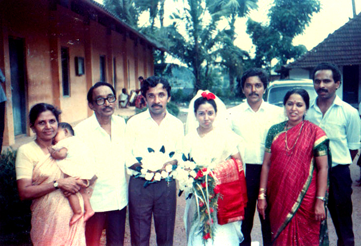

# K.G.Kunjukunju(son of K.S.Gabriel 3.K.F.101)

- Branch : [Branch 3](Branch_3.md)
- Father: [K.S.Gabriel](<K.S.Gabriel(son_of_Vasthyan_(Sebastin)_3.K.F.28).md>)
- Brothers & Sisters : [Thressya](<Thressya(daughter_of_K.S.Gabriel_3.K.F.101).md>) , [K.G.Kunjappan](<K.G.Varghese(son_of_K.S.Gabriel_3.K.F.101).md>) , [K.G.Kuttappan](<K.G.Josep(son_of_K.S.Gabriel_3.K.F.101).md>) , [K.G.Kunjukunju](<K.G.Kunjukunju(son_of_K.S.Gabriel_3.K.F.101).md>) , [K.G.Baby John](<K.G.Baby_John(son_of_K.S.Gabriel_3.K.F.101).md>)
- Childrens : Pamela , Sheeba , Shaji

---

## K.G.KUNJUKUNJU (Alexander)

3.K.F.117/G11(5)**K.G.KUNJUKUNJU (Alexander)**3.T.F.101 10-11-1923. (24 Thulam 1099) after his college studies, he got employment as Post master. He worked in various places namely Pattanakad, Punnapra, Arthunkal, Cherthala and Alleppey etc. He married Mariyama,(21.7.1933 to 18.11.1998) daughter of John (Lonachan)and Kochamma, Pollayil, Chellanam. She died at the age of 65. After retirement, he returned to Arthunkal and settled down near the family house. Ph.0478 257 3823.

G 12.

1.  Pamela (Ajayamalini) (3.K.F.118)
2.  Sheeba (Annie Joy) (3.K.F.119)
3.  Shaji (John Gabriel Majo Alex) (3.K.F.120).

Dr. AJAYA MALINI (PAMELA)3.T.F. 1171957 B.V.Sc. She is Assistant Director in the veterinary dept.

1st married

G 13.

1.  no offspring

3.K.F.118A/G12(1) Pamela married Adv. Joseph Thomas BA,LLB, son of Thomas Thalanani, Thozhupadath, Chelakkara, Kelamangalam Estate, Thrissur. They have a daughter, they reside near St.Mary's Girls H.S., Cherthala. Ph : 0478-281 4731,98471 17510, (O) 281 2383.

 [Click On Click->](http://gallery.bizhat.com/branch-3/p221174-advocate-joseph-thomas2c-dr-pamela.html)

 [Click On Click->](http://gallery.bizhat.com/branch-3/p221173-daya-thomas.html)

2nd married

G 13.

1.  Daya Thomas (Neethu) 1990

 [Click On Click->](http://gallery.bizhat.com/branch-3/p221168-mathew-kuruvilla2c-dr-annie-joy.html)

Dr. ANNIE JOY(SHEEBA)3.T.F.1171959.B.A.M.S. She is the Chief Medical Officer in Govt. Ayurvedic Hospital, Thodupuzha. She married Mathew Kuruvilla, son of C.K. Mathew and Thressiamma, Cherukunnel, Velliyamattam, Thodupuzha. He worked in Velliyamattam service co-operative bank. This family resides at Elamdesham, Thodupuzha. Ph : 0486 227 6640.

G 13.

1.  Bichu (Mathew Kuruvilla) 12-9-1991.

 [Click On Click->](http://gallery.bizhat.com/branch-3/p221171-majo-alex2c-mary-margaret.html)

MAJO ALEX (SHAJI)3.T.F. 11722-10-1961 after his college education at Kalamassery, St. Paul's collage and St. Michacl's college, Cherthala. He spent some time in the political field. He is now employed as Matron (male) in the Govt. special school for the deaf at Kunnamkulam. He married Mary Margaret (Laly) 5-5-1964. M.A.(Lit.), B.Ed.(H.S.A.teacher in Govt. high school), daughter of Lonan Pillai and Alaxandra, Panickaveedu, Thuravoor. She is employed in Revenue Dept. at Palakkad, few months later she got reemployed as HSA teacher. They had a son and a daughter. Ph.0488-251 0757.

 [Click On Click->](http://gallery.bizhat.com/branch-3/p221172-alex-midhun2c-annie-neema.html)

G 13.

1.  Alex Midhun (26-6-1992)
2.  Annie Neema (1-11-1995)
