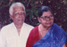
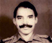
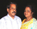
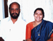

# K.G.Varghese(son of K.S.Gabriel 3.K.F.101)

- Branch : [Branch 3](Branch_3.md)
- Father: [K.S.Gabriel](K.S.Gabriel_son_of_Vasthyan_Sebastin_3.K.F.28-2.md)
- Brothers & Sisters : [Thressya](Thressya_daughter_of_K.S.Gabriel_3.K.F.101.md) , [K.G.Kunjappan](K.G.Varghese_son_of_K.S.Gabriel_3.K.F.101-2.md) , [K.G.Kuttappan](K.G.Josep_son_of_K.S.Gabriel_3.K.F.101.md) , [K.G.Kunjukunju](K.G.Kunjukunju_son_of_K.S.Gabriel_3.K.F.101-2.md) , [K.G.Baby John](K.G.Baby_John_son_of_K.S.Gabriel_3.K.F.101-2.md)
- Childrens : K.V. Thomas Boniface , Annie Mary , K.V.George Sebastian , Mary Grace , K.V. Ignatious Gabriel , Mary Tresa , Mary Angel

---

## K.G.VARGHESE (KUNJAPPAN)

 [Click On Click->](http://gallery.bizhat.com/branch-3/p219338-k-g-vapghese-and-vava-kutty.html)

3.K.F. 104/G11(2). **K.G.VARGHESE (KUNJAPPAN)**3.T.F.101 born in 25 th Nov 1913.(10 th Vrischikam 1089) and died on 22.12.1998. His primary education was at Arthunkal matriculation Govt. H.S., Cherthala. After his education he worked as the area manager of M/s. Singer Sewing machine company at Quilon, afterwards he joined the British army.

At first he worked as clerk in the Indian hospital-core, and after Independence, as store clerk in the Indian army medical core. After five and half years of service he got voluntary discharge from army. At the age of thirty-four he married Barbara (Vava kutty) (25-12-1927) daughter of Vakko and Mary of Kochery, Kumbalongy on 1st.May 1947. She worked as a H.S.A teacher (Hindi). After military service Varghese spent his time in managing family affairs. His public life also includes being the member of the church administrative board as well as being the secretary of Ex-service society. They had seven children. He died on 22.12.1998 at the age of 85.

Address: - Barbara Varghese, Koilparampil house, Arthunkal P.O., Cherthala Pin.688 530, Ph.0478 - 257 2648.

G.12.

1.  K.V. Thomas Boniface(Babu)( 3.K.F.105).
2.  Annie Mary (Laila)( 3.K.F. 106).
3.  K.V.George Sebastian(LAL KOILPARAMPIL)(3.K.F.107).
4.  Mary Grace(Giji)(3.K.F.108)
5.  K.V. Ignatious Gabriel (Kunjumon)(3.K.F.109).
6.  Mary Tresa(Lovely)(3.K.F.110)
7.  Mary Angel(Geena)(3.K.F.111).

 [Click On Click->](http://gallery.bizhat.com/branch-3/p219342-majer-babu.html)

Major BABU (THOMAS BONIFUS)B.A. 29-9-1948. After studies he joined military service and was Major in Maratha Regiment of the Indian army. On 21st May 1975, he married Mary (Sheela), daughter of Antony and Saramma Pazhangad, Vallarpadam. After voluntary discharge from military service, Major Babu worked as the chief security officer in the M.R.F. company in Goa. Now he works as the security officer in the Vasco shipyard Goa. They have two sons.

 [Click On Click->](http://gallery.bizhat.com/branch-3/p219336-gaby-and-gary.html)

G13.

1.  George Sebastian (Gabi) 29-12-1977 Ph.0484 3567883.
2.  Antony Gabriel(Gari)12.11.1983.

 [Click On Click->](http://gallery.bizhat.com/branch-3/p219337-jacob-and-laila.html)

ANNIE MARY(LAILA) 3.T.F. 104 Born on 9-11-1949. She married Jacob, son of Solomen and Cicily, Arukulasseril, Pallithode on 23-1-1978. Jacob is working at Delhi, they have two daughters.

 [Click On Click->](http://gallery.bizhat.com/branch-3/p219335-bincy.html)

G13.

1.  Mary Cicily(Breezy)18-1-1979. M.Sc Micro Biology. National Institute of Oceanography, Cochin.
2.  Annie Mary (Binzy) 18-3-1981 M.Sc. Physics. National Institute of Oceanography, Cochin.

 [Click On Click->](http://gallery.bizhat.com/branch-3/p219341-lal-koilparampil-and-mini-lal.html)

GEORGE SEBASTIN (LAL_KOILPARAMPIL)3.T.F.104 born on 29.9.1952. After studies he joined the Kerla Catholic youth movement. He traveled through out the coastal regions of Kerala in order to strengthen the movement. Then he came to realize the miserable conditions of the poor sea-going fishermen and organized an independent movement. This movement has become a great force in the coastal areas and "Lal Koilparampil" is the unquestioned leader. On 22-5-1987 he married Achamma (Mini) B.Sc.,B.Ed. (H.S.A. teacher in St.Francis Assisi higher secondary school, Arthunkal), daughter of Peter and Mary, Vayalumkal, Kurali, Ponkunnam (Knanaya Jacobite). This family resides near the tharavad house, Ph.0478-2572318

 [Click On Click->](http://gallery.bizhat.com/branch-3/p219343-nidhia-and-nidhin.html)

G13.

1.  Annie Barbara (Nidia)12-4-1989
2.  Peter(Nidin) 2-10-1990.

MARY GRACE(JIGI)3.T.F. 104 M.Sc.(maths) 4-8-1954. She is retired as a Professor in Mathematics from St.Micheal's college, Cherthala. She married Maurice Vincent B.A.,L.L.B., he practices in district court Alappuzha. They have two sons.Ph.98460 11073

G13.

1.  Francis Sebastian (Vigith)31-12-'85. [www.vigith.com]
2.  George Sebastian (Anuj) 30-1-'87.

K.V. IGNATIOUS GABRIEL (KUNJUMON)3.T.F. 104 M.Tech. 7.11.1959, Professor of the Cochin University, on 22nd Aug 1993, he married Mariya (Dhanya) B.Com.(U.S.A.) daughter of Joseph and Roma, Veluthamannumkal, Thrissur. She is employed in U.S.A. Ph.98470 81855

1st marriage

G13.

 [Click On Click->](http://gallery.bizhat.com/branch-3/p219339-k-vignatious-and-vasundhara.html)

K.V. IGNATIOUS GABRIEL (KUNJUMON)3.T.F. 104 M.Tech.

2st marriage

 [Click On Click->](http://gallery.bizhat.com/branch-3/p219340-k-vignatious-childrens.html)

G13.

1.  VISHAL
2.  ISHA

Dr. MARY TREESA (LOVELY)3.T.F. 104 M.A.(Hindi)B.Ed, M.phil, PhD. 29-4-'62 she is working in St.Joseph Higher secondary school Alapuzha. She is married Dr. Clement Lopez M.A. Eco., M.phil, PhD. At present he is the Director of Perform X Educational Foundation (P) Ltd at Statue, Thiruvananthapuram, Trainer in Soft Skills and Research Consultant.contact details : performx@gmail.com, clement.lopez@gmail.com, website : www.performx.in . He is also a tutor for Seminary students in Trivandrum Diocese, and also for the protection of the rights of Latin Catholics. This couple has two daughters.Ph: +471-2330036 (o), 2283662 (r), 09349916933

G13.

1.  Laya Lovely Lopez. 2-12-1992.
2.  Ann Lopez 27-08-2002

MARY ANGEL (GEENA)3.T.F.104 1964 M.A.(Eco) married Roy son of Louies Kochikaran house at Punnapra, Alappuzha.
