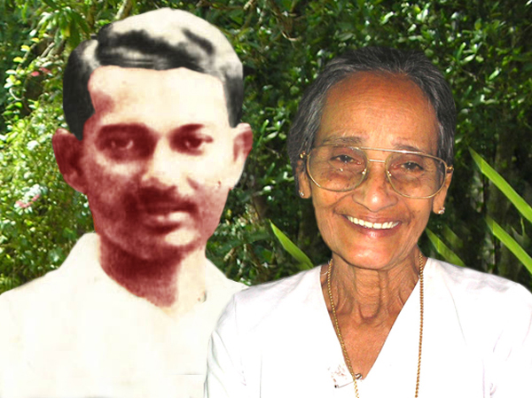
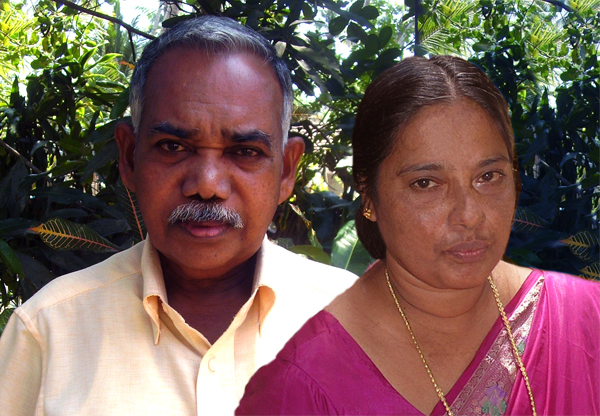
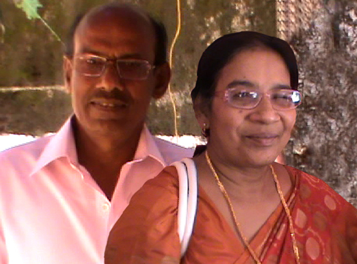
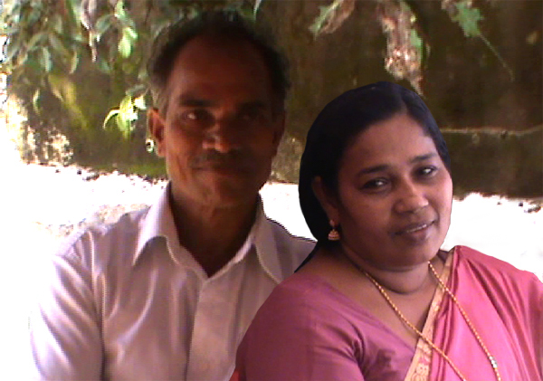
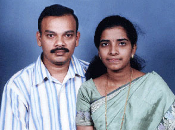
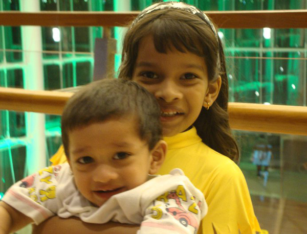

# K.J.Jacob(son of K.S.Joseph 3.K.F.218)

- Branch : [Branch 3](Branch_3.md)
- Father: [K.S.Joseph](<K.S.Joseph(son_of_Vasthyan_(Sebastin)_3.K.F.28).md>)
- Brothers & Sisters : Sr Piya , [K.J.Sebastin](<K.J.Sebastin(son_of_K.S.Joseph_3.K.F.218).md>) , [K.J.Jacob](<K.J.Jacob(son_of_K.S.Joseph_3.K.F.218).md>) , [Annamma](<Annamma(daughter_of_K.S.Joseph_3.K.F.218).md>) , [Elzabeth](<Elzabeth(daughter_of_K.S.Joseph_3.K.F.218).md>) , [Jainamma](<Jainamma(daughter_of_K.S.Joseph_3.K.F.218).md>) , [Juliet](<Juliet(daughter_of_K.S.Joseph_3.K.F.218).md>) , [Kochurani](<Kochurani(daughter_of_K.S.Joseph_3.K.F.218).md>)
- Childrens: Thankachy , Mohan , Shalet , Laila , Pushpam , Sheeba , Joslin , Baiju

---

## K.J. JACOB (AMBI)

 [Mr.& Mrs. K.J.Jacob(Ambi)](http://gallery.bizhat.com/)

3.K.F.224/G11(4)**K.J.JACOB (AMBI)**T.3.F.218 18.9.1923 to 20.12.1980. After his education he served in military, and then in railways. While he was working in Jabalpur Ordinance factory, the sickness of his elder brother Kunjappan who has been working in Mumbai, forced him to resign the job at Jabalpur and accompanied with his brother Kunjappan to return home stayed for a while at home and then he went back to the Jabalpur and started a watch repairing shop. He married **[Evamma](<K.S.Antony(son_of_Vasthyav_(Sebastin)_3.K.F.28).md>)** 5.10.1930T.F.254 the marriage was on 3-8-1949 at Nagapur Cathedral, by his Uncle Rev.Fr.Sebastin Arackal. He after his return from North India started a watch repairing shop near the clock tower at Chinnakkada, Kollam. When the shop in that area was dismantled, he brought a plot near the Arthunkal, Chambakkat junction and started a saw mill (Joslin industries (13.9.1967) here. This might be the first industrial attempt in Arthunkal. At last he severely suffered with blood pressure. He took his last breath in 20th Dec 1980 in the Kottiyam Hospital at the age of 57. Ph. 0478 257 2543.

G12.

1.  Thankachy (Victoria Mariyatta) 5.3.'51(3.K.F.225).
2.  Mohan (Joseph Antony) 14.5.1953-24.11.1954.
3.  Shalet (Fathima)(3.K.F.226).
4.  Laila (Philomina) (3.K.F.227&227.A).
5.  Pushpam (Rosehysintha Jacob) (3.K.F.228).
6.  Sheeba (Annie Dlla)(3.K.F. 229).
7.  Joslin (Joseph Andrew Sebastin Jacob)(3.K.F.230)
8.  Baiju (Paul Antony)(3.K.F.231).

 [Mr.& Mrs.Hilarios Cletus](http://gallery.bizhat.com/)

THANKACHY (VICTORIA MARIYATTA)3.T.F.224 5.3.1951 Sunday. She married Hilarios Cletus 2.1.1948. Son of Varghese Mathew Vavachan and Francisca, Palliparampil, Kattoor. Marriage was on 2-1-1978. Cletus is running a ration shop at Kattoor. Ph.0477 2249542

G13.

1.  Seena (Marey Nirmala) 4.12.1978.
2.  Nana (Juliet) 9-5-1980.
3.  Sithara (Marey Grace) 22-1-1983.

SHALET(FATHIMA)3.T.F.224 4-8-1956 Sunday. After Pre degree she did Lab technician courses. She started her carrier first at Jacob memorial hospital Fort Cochin, shifted to Holy Cross Hospital Kottiyam, Govt. Hospital at Saudi Arabia and after some break now in Saudi Arabia. She Married Pious son of Xavier and Treesa (Kochupennu), Arakkal, Aluva. He was also in Saudi Arabia. afterward he is running Jewelery shop (Arakkal Jewelry) at Eramallor, Cherthala. Besides, he also started a Factory named "Arakkal manufacturing Company" (AMCO) and producing various items like Magic mope, Steel Alamirah etc.

G13.

1.  Shemi (Treesa) 4-9-1989.
2.  Martin Shervin 31-5-1993.

LAILA (Philomina) 3.T.F.224 5.3.1953 Tuesday. She married Babu, son of Sanslavos(Kuttan)of Koilparampil (Kadavunkal) Arithunkal. Branch 5.

G13.No offspring.

Laila's 2nd marriage with Sunny George Thomas, son of Thomas Varghese, (Marthoma) Poiyaniel, Kozhamchery, Pathanamthitta. Ph.04733-231 5175

 [Mr.& Mrs.Thambi](http://gallery.bizhat.com/)

PUSHPAM (ROSE HYSINTHA JACOB)3.T.F.224 8-7-1959 Monday. She married Thambi (Michael Francis) son of Ponchappan and Annakutty of Pareakatil (Kondayyil), Chellanam in 1988. This couple has two children. The family is residing in Bangalore, doing business in silk sarees.

G.13.

1.  Shelly (Clement Jackson) 28-7-1989.
2.  Anumol (Annie Evangaline) 21-11-1990.

 [Mr.& Mrs.Yeusudas](http://gallery.bizhat.com/)

SHEEBA (ANNIE DELLA)3.T.F. 22416-2-1961 Sunday. She married to Yeusudas son of Antony of Kattuvila Padinjattil, Padappakkara, Kundara, Kollam. The family is managing the "S.S.Industries Kattoor"Ph. 0477 261 74 61.

G.13.

1.  Sobin Das 15-9-1982.
2.  Robin Das 20-4-1986.
3.  Binoy(Melbin) 23.1.1988.
4.  Saju(Antony) Koilparampil 4.6.1989.

JOSELINE (JOSEPH ANDREW SEBASTIN JACOB)3.T.F.224 29-11-1965 Monday, After education he worked in Saudi Arabia as air condition and refrigeration operator, after the agreement duration he returned to home and married Lissy (Eleswa) MA(Mal), BEd,SET, daughter of Abraham and Anna kutty, Mampallil, Muhamma (from Kaduthuruthi). She is working as a high school teacher. He took over the management of "Joslin Industries" from his mother.

G.13.

1.  Jacob (Appu).
2.  Atta (Annie Mariyatta).

 [Mr.& Mrs.Biju(Paul Antony)](http://gallery.bizhat.com/)

BIJU(PAUL ANTONY) 3.T.F.224 29-3-1969 Saturday. After his PDC, he studied the air condition and refrigeration at I.T.C. Irinjalakuda, Trissur. He worked as an operator in various companies like Amalgam at Pamaru, in Andara Pradesh, Ayamas Food Corporation in Malaysia, and after in Saudi. He married Sisha B.Sc, B.Ed. Teacher on 6.1.2001, daughter of P.A.Kunjappu and Mary James, H.S.A., of Pareakattil Arthunkal P.O.Cherthala Ph.0478-257 2349.

 [Merlin & Mevin](http://gallery.bizhat.com/)

G13.

1.  Merlin (1.11.2002, 0430h)
2.  Mevin Joseph Baiju
