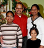

# K.L.Salaous (son of Lavarenthy 4.K.F.109)

- Branch : [Branch 4](Branch_4.md)
- Father : [Lavarenthy](Lavarenthy_son_of_Kochanthira_4.K.F.108.md)
- Brothers & Sisters : [K.L.Luduvick](K.L.Luduvick_son_of_Lavarenthy_4.K.F.109.md) , [K.L.Joseph](K.L.Joseph_son_of_Lavarenthy_4.K.F.109.md) , Fedarick , Mary , [K.L.Salaous](K.L.Salaous_son_of_Lavarenthy_4.K.F.109.md) , [K.L.Stephen](K.L.Stephen_son_of_Lavarenthy_4.K.F.109.md)
- Children : Lilly , Mercy , Sunny , Retty , Josey , Jiji , Pauljerry , Litty , Sisy

---

## K.L.SALAOUS

4.K.F.138/G12(5)**K.L.SALAOUS** 28-1-1907-8-8-1973 [4.T.F.109] married Regeena 1926 [4.K.F.126/G13(3)] Address Rageena Salaus,Koilparambil house,Thiruvambadi P.O. Kuthirapanthy 688002 Ph.0477-225 2109

G.13.

1.  Lilly 1946 (4.K.F.139).
2.  Mercy 18-7-1948(4.K.F.140).
3.  Sunny 5-6-1951(4.K.F.141).
4.  Retty(Maria Goreathy) 30-6-1955(4.K.142).
5.  Josey 8-4-1958(4.K.F.143).
6.  Jiji 9-1-1961(4.K.F.144).
7.  Pauljerry 28-7-1963(4.K.F.145).
8.  Litty 25-12-1965(4.K.F.146).
9.  Sisy 5-3-1969(4.K.F.147).

4.K.139/G13(1)Sr.LILLY 5-1-1946 [4.T.F.138] (Sr.Francine) Brigetain Congregation Calicut.

4.K.F.140/G13(2) MERCY 18-7-1948 [4.T.F.138] married George (Appu) son of Unni Arackal at Chethy. This family is settled near Pues Xth. Church at Kalamassery Earnakulam.

G14.

1.  Francy Sailus (Gillickson)1981.
2.  Loodunick (Garison) 1986.

4.K.F.141/G13(3).SUNNY(Xavier) [4.T.F.138] 5-6-1951 M.B.A. married Aliesyung, daughter of James Hohayo U.S.A. Address-1072 South T.W. Road 159, Tiffin O.H.44883 U.S.A.

G14.

1.  Rageena Savio Koilparambil 1981.
2.  Jestin savio Koilparmbil 1984.
3.  Maginsavio Koilparmbil 1989.

4.K.F.142/G13(4) RETTY(Maria Gorethy[4.T.F.138] 30-6-1955 Medical Office Secretary in Fermond memorial hospital O.H. U.S.A.

4.K.F.143/G13(5)JOSEY 8.4.1958[4.T.F.138]Hotel Business at Wappi, Gujarath.

4.K.F.144/G13(6)JIJI 9-1-1961 [4.T.F.138] married Kochuthresya(Jis)1967 daughter of Jose Kattiparampil Muttathuparampu,Cherthala.

4.K.F.145/G13(7).PAULJERRY 28.7.1963[4.T.F.138]married Bindhu B.Sc, daughter of Francis and Betty of Kadakuthumparambil Mattamchery Cochin. This family is settled in NewYork.

G.14.

1.  Christopher 1999.
2.  Pauljerry 1999

4.K.F.146/G13(8)LITTY(Littil Flower)25-12-1965 [4.T.F.138] married Alex B.Sc, L.L.B.Son of Alocious of Panckalpurackal Kanjiramchira Alleppy. He is employed in health department.

G.14.

1.  Aben P Alex 15-5-1997.
2.  Albin P Alex 10-1-'98.

4.K.F.147/G13(9)CICY 5-3-1969 [4.T.F.138] married Tomy (Thomas)3-7-1967 son of Joseph of Pathyckal at Thathamapally. This family settled in beach ward (near Railway station)Alappuzha.

G.14.

1.  Tesny Mary Thomas 20.7.1997.
2.  Rageena Thomas 12.10.2000.
