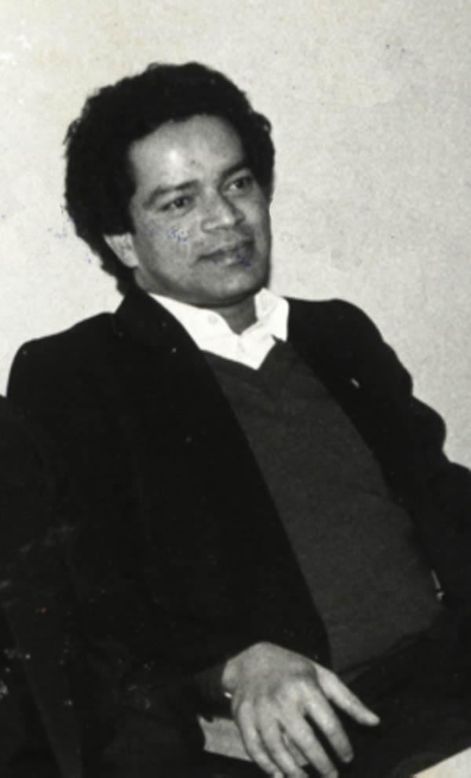

# K.O.Cheriyan (son of K.C.Ouseph)

- Branch : [Branch 2](Branch_2.md)
- Father : [K.C. Ouseph](<K.C._Ouseph(son_of_Cheriyan_2.K.F.1).md>)
- Brothers & Sisters :[K.O.Cheriyan](<K.O.Cheriyan_(son_of_K.C.Ouseph).md>) , [K.O.Varkey](<K.O.Varkey_(son_of_K.C.Ouseph).md>) , K.O.Abraham
- Childrens : [K.C.Joseph](<K.C.Joseph_(son_of_K.O.Ceriyan_2.K.F.3_).md>) , [K.C.Poulose](<K.C.Poulose_(son_of_K.O.Ceriyan_2.K.F.3_).md>) , [Mariyam](<Mariyam_(daughter_of_K.O.Ceriyan_2.K.F.3_).md>) , Antony , Sr.Alies-Flora

---

## K.O.CHERIYAN

2.K.F.3/G10(1).**K.O.CHERIYAN** 1892-1964[2.T.F.2] married Anna daughter of Poulose, Madathiparampil from Vaikom. This family settled at Manappuram P.O. Cherthala.

G.11.

1.  K.C.Joseph/Ouseph (Vava) 1917 (2.K.F.4).
2.  [K.C.Poulose](<K.C.Poulose_(son_of_K.O.Ceriyan_2.K.F.3_).md>) 1919 (2.K.F.11).
3.  [Mariyam](<Mariyam_(daughter_of_K.O.Ceriyan_2.K.F.3_).md>) 1921 (2.K.F.18).
4.  Antony(Anthochan)1923(2.K.25).
5.  Kunju-Annamma (Sr.Alies-Flora) 1925 (2.K.F.26).

2.K.F.4/G11(1). K.C.JOSEPH (OUSEPH/Vava) 1915-1995 School Clark. [2.T.F.3] married Ealykutty from Chambakara at Thrippunithara. This family settled at Vattathara, Manappuram P.O., Cherthala. Ph. 0478 253 2684. G.11.

2.K.F.4/G11(1). K.C.JOSEPH (OUSEPH/Vava) 1915-1995 School Clark. [2.T.F.3] married Ealykutty from Chambakara at Thrippunithara. This family settled at Vattathara, Manappuram P.O., Cherthala. Ph. 0478 253 2684. 12/10/2001

G.12.

1.  1, Chinnamma1940 (2.K.F.5).
2.  2, K. J. Cheriyan 1942 (2.K.F.6)
3.  3, K. J.Joseph 1946(Rev.Fr.Joseph Vattathara C.M.I.) (2.K.8).
4.  4, K.O.Joy (Anthochan/Antony) 1950 (2.K.F.9).

5, K.J., George Joseph 1956(2.K.F.10). 2.K.F.11/G11(2).K.C.PAULOSE 1903-17.2.1979 (Powlochan) Teacher [2.T.F.3]married Ealykutty daughter of Varkey, Cheruvalliel house, Puthenthodu Vaikom. Ph. 0478- 253 2665 Add. Annamma Poulose, Koilparampil (Chackanattuvely) Pallippuram P.O., Cherthala.

2.K.F.18/G11(3).MARIYAM 1918 [2.T.F.3] married Chinnappan (Powlose) son of Chacko Malamel (Pulakkavil), Udayamperoor (near Poothotta). Chinnappan (Chacko) changed his family name as KOIPARAMPIL instead of Malamel (Pulikkavil) and settled at Chacknattuveli,Pallippuram

2.K.25/G11(4).K.C.ANTONY (Anthochann) 1913-1988 [2.T.F.3] lived as bachelor.

2.K.26/G11(5).KUNJANNAMMA (Sr. Aleese Flora) 1918 [2.T.F.3]
