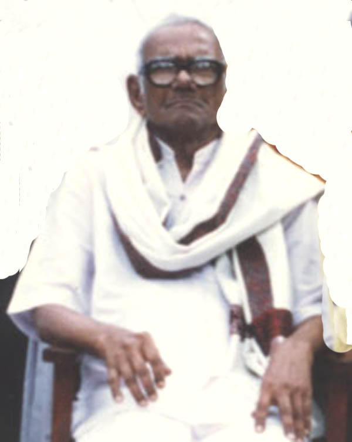
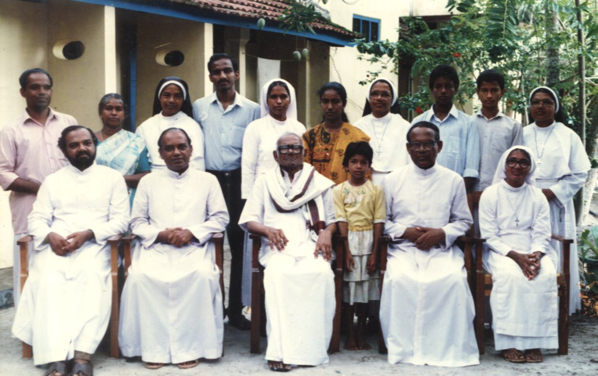

# K.O.Varkey (son of K.C.Ouseph)

- Branch : [Branch 2](Branch_2.md)
- Father : [K.C. Ouseph](<K.C._Ouseph(son_of_Cheriyan_2.K.F.1).md>)
- Brothers & Sisters :[K.O.Cheriyan](<K.O.Cheriyan_(son_of_K.C.Ouseph).md>) , [K.O.Varkey](<K.O.Varkey_(son_of_K.C.Ouseph).md>) , K.O.Abraham
- Childrens :K.V.Caroline Mary , K.V.Joseph , K.V.Grigoria , K.V.Assumpta , K.V.Mathew , K.V.Melani , K.V.George , K.V.Antony

---

## K.O.VARKKY(K.O.Varghese)

 [K.O.Varkey Family](http://gallery.bizhat.com/)

2.K.F.27/G10(2)**K.O.VARKKY(K.O.Varghese)** 10.8.1905-28.6.1994 [2.T.F.2] married Rosamma .

 [K.O.Varkey Family](http://gallery.bizhat.com/)

Sitting : 11,Fr.Mathew Koilparampil. 12,Ouseph Varghese. 13,Fr.Joseph Koilparampil.

2.K. 28/G11(1)Sr. CAROLINE 5.7.1926 [2.T.F.27]

2.K.29/G11(2)Fr. JOSEPH KOILPARAMPIL 11.10.1928 [2.T.F. 27] retired as L.P.School H.M. at Manapuram. At the age of 63 he become a Priest.

2.K.30/G11(3) Sr. GRIGORIA F.C.C 10.3.1933 [2.T.F. 27]

2.K.31/G11(4) Sr. ASSUMPTA F.C.C 2.2.1936 [2.T.F. 27]

2.K.32/G11(5) Fr. MATHEW KOILPARAMPIL 22.11.1938 [2.T.F. 27]

2.K.33/G11(6) Sr.Melani F.C.C 24.10.1940 [2.T.F. 27] Retired as H.M.

2.K.34/G11(7) Fr.Dr.GEORGE KOILPARAMPIL MA,P.hD. 4.3.1944[2.T.F. 27]

2.K.F.35/G11(8).K.V. ANTONY 20.11.1946 [2.T.F. 27] married Rosamma 21.3.1951 daughter of Ouseph Varkey and Mariyam, Pienunkal, Pallipuram Cherthala.Address : K.V.Antony, Koilparampil, Thycattussery P.O.,Cherthala - 688528, Ph : 0478 - 253 2097.

G.12.

1.  Hancemma(Anna)(2.K.F.36).
2.  K.A.George 13.6.1971 (2.K.F.37).
3.  K.A.Joseph 2.5.1980(2.K.38).

2.K.F.36/G12(1)HANCEMMA (ANNA) Hindi Visarath 28.10.1969 [2.T.F.27] married John Martin 18.3.1964 (Mechanic) son of Issac Antony and Chinnamma, Mavuthara, Kaynadi P.O., Alapuzha.

G.13.

1.  Anto 26.10.1997.

2.K.F.37/G12(2).K.A.GEORGE 13.6.1971 I.C.W.A.[2.T.F.27] married Lisa I.C.W.A.,daughter of Joseph Gregary, Pattaniparampil,(providence), Chandhanakavu Cherthala. This family is employed at Ngapur.

2.K.F.38/G12(3)K.A.JOSE B.Com, PGDCA, M.B.A.(doing) 2.5.1980 [2.T.F.27] Next:-[K.C.Pyely](<K.C.Pyely(son_of_Cheriyan_2.K.F.1).md>)
