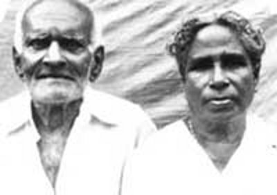

# K.P.Kuruvila (son of K.C.Pyely 2.K.F.39)

- Branch : [Branch 2](Branch_2.md)
- Father : [K.C.Pyely](K.C.Pyely_son_of_Cheriyan_2.K.F.1-2.md)
- Brothers :[K.P.Scaria](K.P.Scaria_son_of_K.C.Pyely_2.K.F.39.md) , [K.P.Kuruvila](K.P.Kuruvila_son_of_K.C.Pyely_2.K.F.39.md)
- Childrens : Mary , Anna , Joseph , Thressya , Kathrykutty

---

## K.P.KURUVILA

2.K.F.48/G10(2)**K.P.KURUVILA** [2.T.F.39]married early daughter of John Koduvathara, Vadayar, Vaikom.

G11.

1.  Mary (2K.F.49).
2.  Anna (2.K.F.50).
3.  Joseph(Ouseph)(2.K.F.51).
4.  Thressya (2.K.F.55).
5.  Kathrykutty (2.K.F.56).

2.K.F.49/G11(1) MARY [2.T.F.48]married Joseph Kunnel at Mannor, Kottayam.

G12.

1.  Jose1953.
2.  Kuruvila 1955.
3.  Marey1957.
4.  Elzamma1959.

2.K.F.50/G11(2)ANNA [2.T.F. 48] married Joseph Valayakottil in Ambaloor, Kottayam

G.12.

1.  Jose 1958.
2.  Chacko1961.
3.  Mary1975. 1980.
4.  Annai.
5.  Delcy1982.

 Mr.& Mrs. K.K.JOSEPH(OUSEPH)

2.K.F.51/G11(3) K.K.JOSEPH(OUSEPH) [2.T.F. 48] married Marykutty(Tessy) daughter of Joseph Malayathara, Eravimangalam at Nedumbracadu, Cherthala.

G.12.

1.  Kuriakose(Kuriappan)(2.K.F.52).
2.  Elzamma(2.K.F.53).
3.  James Kutty(2.K.F.54).

2.K.F.52/G12(1).K.J.KURIAKOSE (KURIAPPAN) [2.T.F.51 ]married Tessy daughter of M.V.Antony and Ealykutty, Thekke_Raylamkulam, Kuravilangadu. Address : Kuriakose K.J., Koipparampil, Manappuram, Ph. 0478-253 3296.

G.13.

1.  Mitty.1993.
2.  Midhun 1995.

2.K.F.53/G12(2) ELZAMMA [2.T.F.51] married Joshy son of Kuriyakose Malayil at Ullala Viakom

G.13.

1.  John (Jobin)

2.K.F.54/G12(3).K.J.JAMES KUTTYBSc.BEd(Teacher) [2.T.F.43] married Annie BSc.BEd. teacher, daughter of Joseph and Mary Madampil house at Eramalloor. This family settled at Manappuram. Ph. 0478-253 3127.

2.K.F.55/G11(4)THRESSYA [2.T.F.48]married Varghese, Kollamkandathil, Udayanapuram, Viakom.

G.12.

1.  Jose.
2.  Kuruvila.
3.  Georgkutty.
4.  Ansamma.
5.  Reji Sini (Sr.F.C.C) Banglore.
6.  Jomy.

2.K.F.56/G11(5) KATHRYKUTTY[2.T.F.48] Sr. Mary Pascal F.C.C. Aluva.
