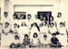

# K.S.Chearian(son of Vasthyan (Sebastin) 3.K.F.28)

- Branch : [Branch 3](Branch_3.md)
- Father : [Vasthyan](Vasthyan_son_of_Kochory_3.K.F.20-2.md)
- Brothers & Sisters : [Margarita](Margarita_daughter_of_Vasthyan_Sebastin_3.K.F.28-2.md), [K.S.Gabriel](K.S.Gabriel_son_of_Vasthyan_Sebastin_3.K.F.28-2.md), [Mariyamma](Mariyamma_daughter_of_Vasthyan_Sebastin_3.K.F.28-3.md), [Eleeswa](Eleeswa_daughter_of_Vasthyan_Sebastin_3.K.F.28-2.md), [K.S.Chearian](K.S.Chearian_son_of_Vasthyan_Sebastin_3.K.F.28-2.md), [Rev.Sr.Marey Beatrice](Rev.Sr.Marey_Beatrice_daughter_of_Vasthyan_Sebastin_3.K.F.28-2.md), [K.S.Joseph](K.S.Joseph_son_of_Vasthyan_Sebastin_3.K.F.28-2.md), [K.S.Antony](K.S.Antony_son_of_Vasthyav_Sebastin_3.K.F.28.md).
- Childrens: [K.C.Chinnappan](K.C.Paul_son_of_K.S.Cheriyan_Mapillai_3.K.F.101-2.md) , [K.C.Kunjukunju](K.C.Kunjukunju_son_of_K.S.Cheriyan_Mapillai_3.K.F.101.md) , PONNAMMA , EAPACHAN , [K.C.Pappy](K.C.Pappy_son_of_K.S.Cheriyan_Mapillai_3.K.F.101-2.md) , [Kunjannamma](Kunjannamma_son_of_K.S.Cheriyan_Mapillai_3.K.F.101-2.md) , [K.C.Eapen](K.C.Eapen_son_of_K.S.Cheriyan_Mapillai_3.K.F.101-2.md) , [K.C.Ponnappan](K.C.Ponnappan_son_of_K.S.Cheriyan_Mapillai_3.K.F.101-2.md) , Rev.Sr.LAURA , Sr. BEATRICE , [K.C.Ummachan](K.C.Ummachan_son_of_K.S.Cheriyan_Mapillai_3.K.F.101-2.md)

---

## K.S.Chearian (S.CHERIYAN MAPILLAI)

 [Click On Click->](http://gallery.bizhat.com/branch-3/p219906-k-s-chearian-2cbiatris.html)

3.K.F.182/G10(5)**K.S.Chearian (S.CHERIYAN MAPILLAI)** 3.T.F.28&51 1888-12.11.1944 Born as the 2nd son of Vasthyan and Anna. He matriculated from St. Burkmen's School Changanassery. On the death of his father he had to forgo higher education and remained at home to assist his mother and elder brother in family matters, most of his life he was involved in the social life of the village and parish affairs.

 [Click On Click->](http://gallery.bizhat.com/branch-3/p219908-k-s-chearian-house.html)

He was the Church trustee of St.Andrew's church, Arthunkal during the period of Fr.Sebastin presentation the Bishop of Cochin His Lordship D.A.A.Das Naviz gave his the task of bringing back the Alienated propertes of the St. Andrews Forane which extended from Marrarikulam in the south to Manakodam in the north. By his tireless efforts he was successful in his mission for which he was honored at a public meeting held at Ottamassery when he was presented with a gold Waterman's pen. He was the main force behind the construction of Arthunkal Marrarikulam road which was inaugurated by Sir C P Ramaswamy Iyer. He was also long time treasurer of the " N. B. Samajam" on a very solid financial foundation.He was the father of 11 children, two of whom died in the infancy.He married- Biatris 25/12/1891-18-4-1965 was the daughter of Paul and Mariya kutty, Therath, Kandackadavu.

 [Click On Click->](http://gallery.bizhat.com/branch-3/p220033-ponnappan2ceapen2cchinnappan2cummachan2ckunjukunju2cpappy2csr-beatrice2csr-.html)

G11.

1.  [K.C.Chinnappan](K.C.Paul_son_of_K.S.Cheriyan_Mapillai_3.K.F.101-2.md)(K.C.Paul)(3.K.F.183).
2.  [K.C.Kunjukunju](K.C.Kunjukunju_son_of_K.S.Cheriyan_Mapillai_3.K.F.101.md)(Sebastin)(3.K.F.188).
3.  PONNAMMA and EAPACHAN(died in infancy)
4.  [K.C.Pappy](K.C.Pappy_son_of_K.S.Cheriyan_Mapillai_3.K.F.101-2.md)(Joseph) (3.K.F.190).
5.  [Kunjannamma](Kunjannamma_son_of_K.S.Cheriyan_Mapillai_3.K.F.101-2.md)(3.K.F.194)
6.  [K.C.Eapen](K.C.Eapen_son_of_K.S.Cheriyan_Mapillai_3.K.F.101-2.md)(3.K.F.199).
7.  [K.C.Ponnappan](K.C.Ponnappan_son_of_K.S.Cheriyan_Mapillai_3.K.F.101-2.md)(K.C.VARGHESE)(3.K.F 208).
8.  Kanakamma(Rev.Sr.LAURA)(3.K.210).
9.  Valsamma(Sr. BEATRICE)(3.K.211).
10. [K.C.Ummachan](K.C.Ummachan_son_of_K.S.Cheriyan_Mapillai_3.K.F.101-2.md)(Thomas)(3.K.F.212).

 [Click On Click->](http://gallery.bizhat.com/branch-3/p219907-old-family-photo.html)

 [Click On Click->](http://gallery.bizhat.com/branch-3/p219935-sr-beatrice.html)

3.K.210/G11(7)**Rev.Sr.LAURA(KANAKAMMA)**B.A.3.T.F.182 6-2-1932 she joined Holy angels convent. Later she was mother at St.Aloshyous convent Cherakal, Anjuthengu, there she founded an English medium school after some time she was Novice mistess at Valuable convent Pallurithy Cochin. She is also the founder and administrator of the English medium school at Mariyan Villa convent, Kumarapuram at Thiruvanathapuram.Now she is at St.Joseph's Convent Tuet Kollam,her Golden Jubilee was clebrated on friday the 26th Dec:2003.

 [Click On Click->](http://gallery.bizhat.com/branch-3/p219926-rev-sr-laura.html)

3.K.211/G11(8)**Sr. BEATRICE (VALSAMMA)**3.T.F.1826-6-1933 After studies she joined the Sisters of Mary Immaculate Congregation at Bengal, founded by the late Bishop Moro.
