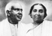
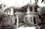
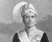
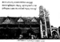
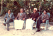

# K.S.Gabriel(son of Vasthyan (Sebastin) 3.K.F.28)

- Branch : [Branch 3](Branch_3.md)
- Father : [Vasthyan](Vasthyan_son_of_Kochory_3.K.F.20-2.md)
- Brothers & Sisters : [Margarita](Margarita_daughter_of_Vasthyan_Sebastin_3.K.F.28.md), [K.S.Gabriel](K.S.Gabriel_son_of_Vasthyan_Sebastin_3.K.F.28.md), [Mariyamma](Mariyamma_daughter_of_Vasthyan_Sebastin_3.K.F.28-3.md), [Eleeswa](Eleeswa_daughter_of_Vasthyan_Sebastin_3.K.F.28.md), [K.S.Chearian](K.S.Chearian_son_of_Vasthyan_Sebastin_3.K.F.28.md), [Rev.Sr.Marey Beatrice](Rev.Sr.Marey_Beatrice_daughter_of_Vasthyan_Sebastin_3.K.F.28.md), [K.S.Joseph](K.S.Joseph_son_of_Vasthyan_Sebastin_3.K.F.28.md), [K.S.Antony](K.S.Antony_son_of_Vasthyav_Sebastin_3.K.F.28.md).
- Childrens: [Thressya](Thressya_daughter_of_K.S.Gabriel_3.K.F.101.md) , [K.G.Varghese](K.G.Varghese_son_of_K.S.Gabriel_3.K.F.101-2.md) , [K.G.Kuttappan](K.G.Josep_son_of_K.S.Gabriel_3.K.F.101.md) , [K.G.Kunjukunju](K.G.Kunjukunju_son_of_K.S.Gabriel_3.K.F.101-2.md) , [K.G.Baby John](K.G.Baby_John_son_of_K.S.Gabriel_3.K.F.101-2.md)

---

## K.S.GABRIEL

3.K.F.101/G10(2)**K.S.GABRIEL** 1876 - 14.1.1954. 3.T.F.28&51 born on 15th March 1876 (1051 Meenam 1) as the eldest son of Koilparampil Vasthyan (Sebastian) and Anna. After matriculating from St.Berchman's School, at Changanachery, he spent most of his time assisting his father in managing house hold affairs. In 1905 he married Barbara, daughter of "Velutha Vasthyan", belonging to Parayakattil family Pallithode. Unfortunately the bride died due to the certain illness after two years. In this marriage, no issues. Later in 1910, he remarried Annamma, daughter of John and Mary, Kunnel (Palackal), Manassery. In this marriage they had four sons and a daughter. In 1915 KS Gabriel founded a moral reformation Society at Arthunkal named "Sanmarga Parishkara Sangham". Rev.Fr. Sebastian L.C.B.D. presentation was the President, K.S.Gabrial was its vice president. The main aim of this Sangham was the abolition of liquor and religious reforms. And also he was the President of the "Nazarani Bhooshana Samajam" of today.

He played a remarkable role in raising the awareness of the Latin Christaians in this regard. While working as the administrator (Kaikaran) of St. Andrew's church, he supervised the digging of the canal (Puthenthodu) for bringing the raw materials and Rubles for construction of church building. The foundation of the new church was also built during this period.

 V.J.T. Hall 2004

In those days in order to cast a vote in the "Travancore Sree-Moolam-Thirunnal Praja Sabha", one must be a land owner who pays a casual tax of Rs.100/- it was reduced to Rs.25/- the main families of Arthunkal determined the candidate from the Cherthala constituent assembly. As such case K.S.Gabriel and his brothers had the right to cast their votes in the Prajasabha the following members are voters they are :

1.  Veazhaparampan
2.  Poovandath Kurup
3.  Aakka
4.  Chennothu Shivarama Panicker
5.  Puliyamkottu 'Anchelmash'
6.  Thenjapurackan Puliamkottu
7.  Jothish kumar's father and his brother, of Parathyampally at Thycal
8.  Anthraper
9.  St.Andrew's Church Arthunkal
10. K.P.Devasey Kurusinkal(3.Ku.F.46).
11. K.P.Amar Kurusinkal (3.Ku.F.47).
12. K.P.Benjamin Kurusinkal(3.Ku.F.48).
13. K.D.Pavalu Kurusinkal
14. Joseph Kurusinkal (Kochuklluveeden)
15. Duminkose Kurusinkal (Valiyakalluveeden)
16. K.P.Basthyon(Bastin) Koilparampil(5.K.F.5)
17. Gregary Koilparampil (5.K.F.6.).
18. Very Rev. Fr.Augustine Koilparampil (5.K.F.38.A.).
19. Kuttyali-vava Koilparampil(6.K.F.132.)
20. K.S.Gabriel Koilparampil (3.K.F.101)
21. K.S.Cherian Koilparampil ( 3.K.F.182).
22. K.S.Joseph Koilparampil(3.K.F.218)
23. K.S.Antony Koilparampil( 3.K.F.254)

Once when Gabriel was the administrator, he invited Divan M.E.Watts to Arthunkal and it was owing to his tireless efforts that the Cherthala - Arthunkal road, which then ended at Chambakad was extended via the church premises to the beach. He was an honest man, sincere in all his dealings towards the Church as well as towards the poor fishermen of the place. In his trusteeship period the arch bridge was built across the ARTHUNKAL CANAL (Valiya thode)under the supervision of a Tamil Mason named Varghese, he was accustomed to wear 'Kavi clothes'. In order to prove the strength of the bridge Varghese Mason made an elephant-walk over the bridge while he stood under it. He did a great deal for the public good. He breathed his last on 14th Jan 1954. His wife Annamma died on 25th Nov 1964.

G.11.

1.  [Thressya](Thressya_daughter_of_K.S.Gabriel_3.K.F.101.md) (Thankamma)(3.K.F.102).
2.  [K.G.Varghese](K.G.Varghese_son_of_K.S.Gabriel_3.K.F.101-2.md) (Kunjappan)(3.K.F. 104).
3.  [K.G.Josep](K.G.Josep_son_of_K.S.Gabriel_3.K.F.101.md) (Kuttappan)(3.K.F.112).
4.  [K.G.Kunjukunju](K.G.Kunjukunju_son_of_K.S.Gabriel_3.K.F.101-2.md) (Alexander)(3.K.F.117).
5.  [K.G.Baby John](K.G.Baby_John_son_of_K.S.Gabriel_3.K.F.101-2.md)(3.K.F.121).
