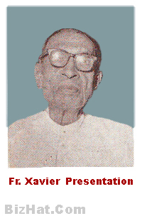

# Kochory(son of Faranth/Francis 3.K.F.5)

- Branch : [Branch 3](Branch_3.md)
- Father : [Vathan](Vathan_son_of_Varuth_3.K.F.3-2.md)
- Brothers: [Mighel(Michael)](Mighel_Michael_son_of_Faranth_Francis_3.K.F.5.md) , [Kochory](Kochory_son_of_Faranth_Francis_3.K.F.5.md)
- Childrens: 1.-----, 2.----- , 3.------ , 4.----- , 5. Clara , 6. [Vasthyan](Vasthyan_son_of_Kochory_3.K.F.20-2.md) , 7. Kathreena.

---

## KOCHORY

3.K.F.20/G8 (2).KOCHORY 3.T.F. 4 married Mariyam, was born on 1809 she was from Kurisinkal family at Kochi, who had seven daughters and a son. The names of some daughters are unknown [the dates and details about Predecessors, are mentioned in this write up as per the church census of 1861 i.e. reference from the book given for to make a fresh copy, by His Excellency Bishop Michael Arattukulam to Munshi Joseph (the teacher from Kunnel family Aruthinkal). the basic date mentioned in this work.] The following were the families in which seven daughters were married. They are respectively :

G.9.

1.  Veluthamannunkal at Chellanam.
2.  Paliyathayil at Thycal.
3.  Charankattu at Chennavely (mother of Karalman Jorusu).
4.  Kalapurakkal at Edakochi. 5,Kaithavalppil Saudi, Kochin.
5.  Clara (3.K.F.21).
6.  **[Vasthyan](Vasthyan_son_of_Kochory_3.K.F.20-2.md)(Sebastin)(3.K.F.28).**
7.  Kathreena at Puthenpurakkal, Kochi.

CLARA T.3.F.20 married Koch Ousay Valiyathayil at Kattoor.

G11.

1.  Rageena (3.F.22).
2.  Aganeesa (3.F.23).
3.  Miguel (3.F.24).
4.  Vasthyan (3.F.26).
5.  Karaly (3.F.27).

RAGEENA 3.T.F.21 married Lonan Kakkary (Thayil Pedika) at Chennavely.

AGANEESA T.3.F.21 married Thamby, Koilparampil Arthunkl 6.K.F.106/G10(1)

MIGHEL(MICHAEL) 3.T.F. 21

G12.

1.  Vavachan (Sebastin).

VAVACHAN (SEBASTIN) teacher 3.T.F. 24

G13.

1.  Mariyam.
2.  Kunjukunju 'Maizar.

VASTHYAN 3.T.F. 21

 [Fr. Xavier presentation](http://gallery.bizhat.com/old-photos-of-priests/p186165-fr-xavier-presentation.html/)

G.12.

1.  Rev. Fr. Xavier presentation.

KARALI T.3.F. 21 married in the Vattathayil at Thumboly.
