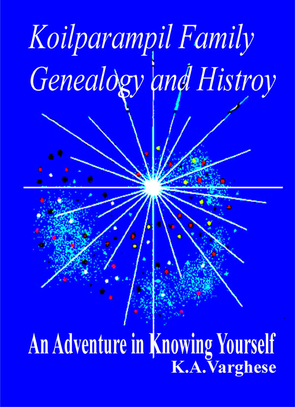
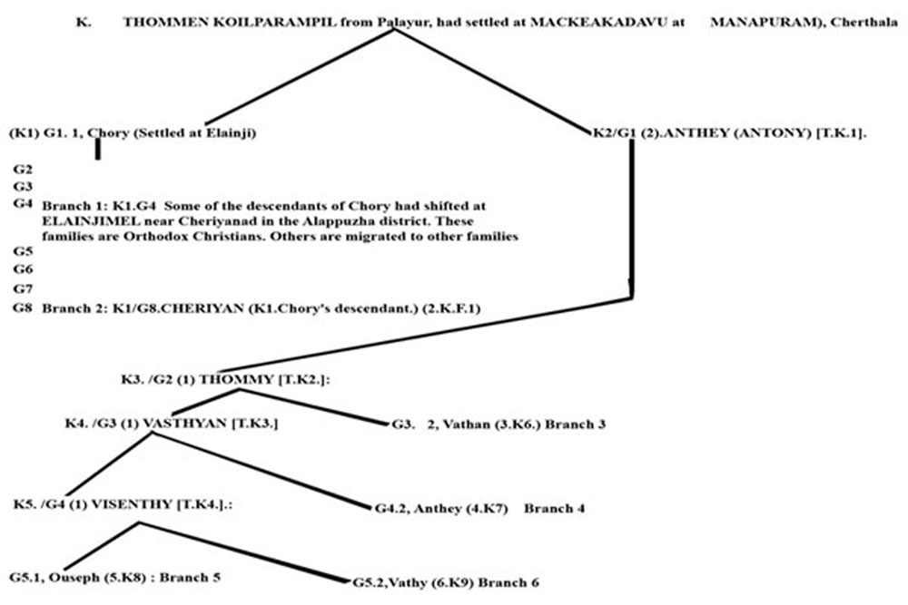

# Main Page

[Photo Gallery](http://gallery.bizhat.com/showgallery.php?ppuser=19920&username=koilparampil)

# KOILPARAMPIL FAMILY GENEALOGY AND HISTORY

Kerala, India

## INTRODUCTION

The description of the history of Koilparampil (Coilparampil) family in terms of periodic details and accuracy is so difficult and not an easy one. Writing history is generally based on traditions, customs, folklore etc. Thus it may miss the authenticity and may inherently contain the loopholes for contrasting conclusions and opinions. You may find the same limitations in this attempt too. First of all let me state that it was my parents who inspired me to initiate and to pursue this attempt. What I have presented here to a greater extent is something derived and generated out of my direct search.

I present this work with the hope that this may helpful for the later generations of this family which scattered around the world, to know each other and to get inspired from the life of each one of these families.

Finally, I owe my special thanks to Mrs. Mary Margaret & Sebastian J. Koilparampil, Arthunkal who holds a unique position as English teacher made the English version of this book in the exquisite language

[K.A. Varghese](K.A._Varghese_Eugene_Varghese_Kochappan.md)

Date 24.4.1990

## [Branch 1](Branch_1.md)

## [Branch 2](Branch_2.md)

[Cheriyan](Cheriyan_Branch_2.md)--\> Mary , [K.C. Ouseph](K.C._Ouseph_son_of_Cheriyan_2.K.F.1-2.md) , [K.C.Pyely](K.C.Pyely_son_of_Cheriyan_2.K.F.1-2.md) , [K.C.Cheriyan](K.C.Cheriyan_son_of_Cheriyan_2.K.F.1-2.md) , [K.C. Varkey](K.C._Varkey_son_of_Cheriyan_2.K.F.1-2.md) , [K.C. Antony](K.C._Antony_son_of_Cheriyan_2.K.F.1-2.md)

[K.C. Ouseph](K.C._Ouseph_son_of_Cheriyan_2.K.F.1-2.md)--\> K.O.Abraham , [K.O.Cheriyan](K.O.Cheriyan_son_of_K.C.Ouseph.md) , [K.O.Varkey](K.O.Varkey_son_of_K.C.Ouseph.md)

[K.O.Cheriyan](K.O.Cheriyan_son_of_K.C.Ouseph.md)--\> Antony , Sr.Alies-Flora , [K.C.Joseph](K.C.Joseph_son_of_K.O.Ceriyan_2.K.F.3.md) , [K.C.Poulose](K.C.Poulose_son_of_K.O.Ceriyan_2.K.F.3.md) , [Mariyam](Mariyam_daughter_of_K.O.Ceriyan_2.K.F.3.md)

[K.C.Pyely](K.C.Pyely_son_of_Cheriyan_2.K.F.1-2.md)--\> [K.P.Scaria](K.P.Scaria_son_of_K.C.Pyely_2.K.F.39.md) , [K.P.Kuruvila](K.P.Kuruvila_son_of_K.C.Pyely_2.K.F.39.md)

[K.C.Cheriyan](K.C.Cheriyan_son_of_Cheriyan_2.K.F.1-2.md)--\> Pappu , Mamy

Pappu--\> Mary , [Antony](Antony_son_of_K.C.Pappu_2.K.F.58.md) , [Varghese](Varghese_son_of_K.C.Pappu_2.K.F.58.md) , [Cheriyan](Cheriyan_son_of_K.C.Pappu_2.K.F.58.md) , [Jose](Jose_son_of_K.C.Pappu_2.K.F.58.md)

[K.C. Varkey](K.C._Varkey_son_of_Cheriyan_2.K.F.1-2.md)--\> Kathrey , [K.V.Cheriyan](Cheriyan_son_of_K.C.Varkey_2.K.F.83.md) , [K.V.Joseph](Joseph_son_of_K.C.Varkey_2.K.F.83.md)

## [Branch 3](Branch_3.md)

[Vathan](Vathan_branch_3-2.md)--\> Thommy

Thommy--\> Varuth

Varuth--\> [Vathan](Vathan_son_of_Varuth_3.K.F.3-2.md)

[Vathan](Vathan_son_of_Varuth_3.K.F.3-2.md)--\> [Mighel(Michael)](Mighel_Michael_son_of_Faranth_Francis_3.K.F.5.md) , [Kochory](Kochory_son_of_Faranth_Francis_3.K.F.5.md)

[Kochory](Kochory_son_of_Faranth_Francis_3.K.F.5.md)--\> Clara , Kathreena , [Vasthyan](Vasthyan_son_of_Kochory_3.K.F.20-2.md)

[Vasthyan](Vasthyan_son_of_Kochory_3.K.F.20-2.md) Married--\> [Anna](Anna.md)

[Vasthyan](Vasthyan_son_of_Kochory_3.K.F.20-2.md)--\> [Margarita](Margarita_daughter_of_Vasthyav_Sebastin_3.K.F.28.md) , [K.S.Gabriel](K.S.Gabriel_son_of_Vasthyan_Sebastin_3.K.F.28-2.md) , [Mariyamma](Mariyamma_daughter_of_Vasthyav_Sebastin_3.K.F.28.md) , [Eleeswa](Eleeswa_daughter_of_Vasthyav_Sebastin_3.K.F.28.md) , [K.S.Chearian](K.S.Chearian_son_of_Vasthyan_Sebastin_3.K.F.28-2.md) , [Rev.Sr.Marey Beatrice](Rev.Sr.Marey_Beatrice_daughter_of_Vasthyav_Sebastin_3.K.F.28.md) , [K.S.Joseph](K.S.Joseph_son_of_Vasthyav_Sebastin_3.K.F.28.md) , [K.S.Antony](K.S.Antony_son_of_Vasthyav_Sebastin_3.K.F.28.md)

[K.S.Gabriel](K.S.Gabriel_son_of_Vasthyan_Sebastin_3.K.F.28-2.md)--\> [Thressya](Thressya_daughter_of_K.S.Gabriel_3.K.F.101.md) , [K.G.Varghese](K.G.Varghese_son_of_K.S.Gabriel_3.K.F.101-2.md) , [K.G.Josep](K.G.Josep_son_of_K.S.Gabriel_3.K.F.101.md) , [K.G.Kunjukunju](K.G.Kunjukunju_son_of_K.S.Gabriel_3.K.F.101-2.md) , [K.G.Baby John](K.G.Baby_John_son_of_K.S.Gabriel_3.K.F.101-2.md)

[K.S.Chearian](K.S.Chearian_son_of_Vasthyan_Sebastin_3.K.F.28-2.md)--\> Ponnamma , Eapachan , Rev.Sr.Laura , Sr. Beatrice , [K.C.Chinnappan](K.C.Paul_son_of_K.S.Cheriyan_Mapillai_3.K.F.101-2.md) , [K.C.Kunjukunju](K.C.Kunjukunju_son_of_K.S.Cheriyan_Mapillai_3.K.F.101.md) , [K.C.Pappy](K.C.Pappy_son_of_K.S.Cheriyan_Mapillai_3.K.F.101-2.md) , [Kunjannamma](Kunjannamma_son_of_K.S.Cheriyan_Mapillai_3.K.F.101-2.md) , [K.C.Eapen](K.C.Eapen_son_of_K.S.Cheriyan_Mapillai_3.K.F.101-2.md) , [K.C.Ponnappan](K.C.Ponnappan_son_of_K.S.Cheriyan_Mapillai_3.K.F.101-2.md) , [K.C.Ummachan](K.C.Ummachan_son_of_K.S.Cheriyan_Mapillai_3.K.F.101-2.md)

[K.S.Joseph](K.S.Joseph_son_of_Vasthyav_Sebastin_3.K.F.28.md)--\> Sr Piya , [K.J.Kunjappan](K.J.Sebastin_son_of_K.S.Joseph_3.K.F.218-2.md) , [K.J.Jacob](K.J.Jacob_son_of_K.S.Joseph_3.K.F.218-2.md) , [Annamma](Annamma_son_of_K.S.Joseph_3.K.F.218-2.md) , [Elzabeth](Elzabeth_son_of_K.S.Joseph_3.K.F.218-2.md) , [Jainamma](Jainamma_son_of_K.S.Joseph_3.K.F.218-2.md) , [Juliet](Juliet_son_of_K.S.Joseph_3.K.F.218-2.md) , [Kochurani](Kochurani_son_of_K.S.Joseph_3.K.F.218-2.md)

[K.S.Antony](K.S.Antony_son_of_Vasthyav_Sebastin_3.K.F.28.md)--\> K.A. Sebastin , [Evamma](K.J.Jacob_son_of_K.S.Joseph_3.K.F.218-2.md) , [K.A.Thankachan](K.A.Thankachan_son_of_K.S.Antony_3.K.F.254.md) , [K.A.Kochappan](K.A.Kochappan_son_of_K.S.Antony_3.K.F.254.md) , [K.A.Edison](K.A.Edison_son_of_K.S.Antony_3.K.F.254.md) , [Kusumum](Kusumum_daughter_of_K.S.Antony_3.K.F.254.md) , [K.A.Cherian](K.A.Cherian_son_of_K.S.Antony_3.K.F.254.md) , [K.A.Josey](K.A.Josey_son_of_K.S.Antony_3.K.F.254.md) , [K.A.George Kutty](K.A.George_Kutty_son_of_K.S.Antony_3.K.F.254.md)

## [Branch 4](Branch_4.md)

Thomman--\> [Vathy](Vathy_son_of_4.K.F.2_G4.Thomman.md) , [Ousea](Ousea_son_of_4.K.F.2_G4.Thomman.md)

- [Vathy](Vathy_son_of_4.K.F.2_G4.Thomman.md)--\> [Kochu Vathy](Kochu_Vathy_son_of_Sanchan_K.F.5.md) , [Antho](Antho_son_of_Sanchan_K.F.5.md) , [Ponchi](Ponchi_son_of_Sanchan_K.F.5.md)

[Kochu Vathy](Kochu_Vathy_son_of_Sanchan_K.F.5.md)--\> Ousay , Sawreyar , [Tressyamma](Tressyamma_daughter_of_Sanchan_4.K.F.7.md) , [Claramma](Claramma_daughter_of_Sanchan_4.K.F.7.md) , [Lonan](Lonan_son_of_Sanchan_4.K.F.7.md)

[Tressyamma](Tressyamma_daughter_of_Sanchan_4.K.F.7.md)--\> Ousaw, [Vacko](Vacko_son_of_Tressyamma_4.K.F.11.md)

[Antho](Antho_son_of_Sanchan_K.F.5.md)--\> [Kochu-Kaippary](Kochu-Kaippary_son_of_Kochu_Sanchan_4.K.F.74.md) , [Kochanthira](Kochanthira_son_of_Kochu_Sanchan_4.K.F.74.md) , [Vasthyon](Vasthyon_son_of_Kochu_Sanchan_4.K.F.74.md) , [Kunjuousay](Kunjuousay_son_of_Kochu_Sanchan_4.K.F.74.md) , [Lonachan](Lonachan_son_of_Kochu_Sanchan_4.K.F.74.md)

[Kochu-Kaippary](Kochu-Kaippary_son_of_Kochu_Sanchan_4.K.F.74.md)--\> Jorus , Achamvava , [Marsily](Marsily_son_0f_Kochu-Kaippary_4.K.F.75.md) , [Silvester](Silvester_son_0f_Kochu-Kaippary_4.K.F.75.md) , [Cornelious](Cornelious_son_0f_Kochu-Kaippary_4.K.F.75.md)

[Kochanthira](Kochanthira_son_of_Kochu_Sanchan_4.K.F.74.md)--\> Jonamma , Jewsenju , [Lavarenthy](Lavarenthy_son_of_Kochanthira_4.K.F.108.md) , [Vasthiankutty](Vasthiankutty_son_of_Kochanthira_4.K.F.108.md) , [Xavier](Xavier_son_of_Kochanthira_4.K.F.108.md) , [Cicily](Cicily_daughter_of_Kochanthira_4.K.F.108.md)

[Lavarenthy](Lavarenthy_son_of_Kochanthira_4.K.F.108.md)--\> Fedarick , Mary , [K.L.Luduvick](K.L.Luduvick_son_of_Lavarenthy_4.K.F.109.md) , [K.L.Joseph](K.L.Joseph_son_of_Lavarenthy_4.K.F.109.md) , [K.L.Salaous](K.L.Salaous_son_of_Lavarenthy_4.K.F.109.md) , [K.L.Stephen](K.L.Stephen_son_of_Lavarenthy_4.K.F.109.md)

[Ponchi](Ponchi_son_of_Sanchan_K.F.5.md)--\> [Dhumink](Dhumink_son_of_Sawreyar_4.K.F.223.md) , [Ouseph](Ouseph_son_of_Sawreyar_4.K.F.223.md)

- [Ousea](Ousea_son_of_4.K.F.2_G4.Thomman.md)--\> [Thoma](Thoma_son_of_Jusa_4.K.F.264.md) , [Michael](Michael_son_of_Jusa_4.K.F.264.md)

[Thoma](Thoma_son_of_Jusa_4.K.F.264.md)--\> [Vasthyon](Vasthyon_son_of_Thoma_4.K.F.265.md) , [Lonan](Lonan_son_of_Thoma_4.K.F.265.md) , [Jorus](Jorus_son_of_Thoma_4.K.F.265-2.md)

[Vasthyon](Vasthyon_son_of_Thoma_4.K.F.265.md)--\> [Kochanthira](Kochanthira_son_of_Vasthyon_4.K.F.266.md) , [Ouseph](Ouseph_son_of_Vasthyon_4.K.F.266-2.md) , [Patharose](Patharose_son_of_Vasthyon_4.K.F.266.md) , [Lonan](Lonan_son_of_Vasthyon_4.K.F.266-2.md)

[Patharose](Patharose_son_of_Vasthyon_4.K.F.266.md)--\> Plameena , K.P.Plameena , [K.P Joseph](K.P_Joseph_son_of_Pathrose.md) , [Michael](Michael_son_of_Pathrose.md) , [K.P.Peeter](K.P.Peeter_son_of_Pathrose.md) , [K.P.Sebastian](K.P.Sebastian_son_of_Pathrose.md)

[Lonan](Lonan_son_of_Thoma_4.K.F.265.md)--\> [K.L.Vasthyon](K.L.Vasthyon_son_of_Lonan_4.K.F.399.md)

[K.L.Vasthyon](K.L.Vasthyon_son_of_Lonan_4.K.F.399.md)--\> Thomas , Ponnunni , Samson , [Lona](Lona_son_of_K.L.Vasthyon_4.K.F.400.md) , [Yohannan](Yohannan_son_of_K.L.Vasthyon_4.K.F.400.md) , [Joseph](Joseph_son_of_K.L.Vasthyon_4.K.F.400.md) , [Leon](Leon_son_of_K.L.Vasthyon_4.K.F.400.md)

[Jorus](Jorus_son_of_Thoma_4.K.F.265-2.md)--\> [Raphel](Raphel_son_of_Jorus_4.K.F.433.md) , [Philipose](Philipose_son_of_Jorus_4.K.F.433-2.md) , [Sipri](Sipri_son_of_Jorus_4.K.F.433-2.md)

[Michael](Michael_son_of_Jusa_4.K.F.264.md)--\> [Peter](Peter_Son_of_Michael_4.K.F.473.md) , [Lonan](Lonan_Son_of_Michael_4.K.F.473.md)

[Peter](Peter_Son_of_Michael_4.K.F.473.md)--\> [Michael](Michael_Son_of_Peeter4.K.F.474.md) , [Vathan](Vathan_Son_of_Peeter4.K.F.474.md) , [K.P.Jusay](Jusay_Son_of_Peeter4.K.F.474.md)

[Michael](Michael_Son_of_Peeter4.K.F.474.md)--\> [Kakkunni](Kakkunni_Son_of_Michael_4.K.F.475.md) , [Anthappan](Anthappan_Son_of_Michael_4.K.F.475.md)

[Kakkunni](Kakkunni_Son_of_Michael_4.K.F.475.md)--\> [Kochu Pillai](Kochu_Pillai_Son_of_Kakkunni_4.K.F.476.md) , [Abraham](Abraham_Son_of_Kakkunni_4.K.F.476.md) , [Samson](Samson_Son_of_Kakkunni_4.K.F.476.md) , [Albert](Albert_Son_of_Kakkunni_4.K.F.476.md) , [Michael](Michael_Son_of_Kakkunni_4.K.F.476.md) , [Earnest](Earnest_Son_of_Kakkunni_4.K.F.476.md)

[Vathan](Vathan_Son_of_Peeter4.K.F.474.md)--\> [John](John_son_of_Vathen_4.K.F.569.md) , [Thomas](Thomas_son_of_Vathen_4.K.F.569.md) , [Jusay](Jusay_son_of_Vathen_4.K.F.569.md)

[John](John_son_of_Vathen_4.K.F.569.md)--\> [Michael](Michael_son_of_K.V.John_4.T.F.541-2.md) , [Thomas](Thomas_son_of_K.V.John_4.T.F.541-2.md)

[Lonan](Lonan_Son_of_Michael_4.K.F.473.md)--\> [K.L.Andrew](K.L.Andrew_son_of_4.K.F.630_Lonan.md) , [K.L.Vasthiyon](Vasthiyon_son_of_4.K.F.630_Lonan.md) , [K.L.Jusay](K.L.Jusay_son_of_4.K.F.630_Lonan.md)

## [Branch 5](Branch_5.md)

[Ouseph](Ouseph.md)--\> [Vasthyon](Vasthyon_son_of_Ouseph_5_K.F.1-2.md) , [Kochuvava](Kochuvava_son_of_Ouseph_5_K.F.1-2.md) , [Vaishyan](Vaishyan_son_of_Ouseph_5_K.F.1-2.md) , [Thoma](Thoma_son_of_Ouseph_5_K.F.1-2.md)

[Vasthyon](Vasthyon_son_of_Ouseph_5_K.F.1-2.md)--\> Visenthy

Visenthy---\> [Ponchi](Ponchi_son_of_Visenthy_5.K.F.3-2.md) , [Kunjuvareethu](Kunjuvareethu_son_of_Visenthy_5.K.F.3-2.md) , [Vathy](Vathy_son_of_Visenthy_5.K.F.3-2.md)

[Ponchi](Ponchi_son_of_Visenthy_5.K.F.3-2.md)--\> K.P.Bastin , Augustin , Vava1874 , Maryakutty , Annamma , [K.P.Gregory](K.P.Gregory_son_of_Ponchi_5.K.F.4.md)

[K.P.Gregory](K.P.Gregory_son_of_Ponchi_5.K.F.4.md)--\> [Ousepachan](Ousepachan_son_of_K.P.Gregory_5.K.F.6.md) , [Chavaro](Chavaro_son_of_K.P.Gregory_5.K.F.6.md) , [Vasthyonkunju](Vasthyonkunju_son_of_K.P.Gregory_5.K.F.6.md) , [Kunjamma](Kunjamma_daughter_of_K.P.Gregory_5.K.F.6.md)

[Vathy](Vathy_son_of_Visenthy_5.K.F.3-2.md)--\> [Visenthy](Visenthy_son_of_Vathy_Vasthyon_5.K.F.98-2.md) , [Ouseppachan](Ouseppachan_son_of_Vathy_Vasthyon_5.K.F.98-2.md) , [Ulvedath](Ulvedath_son_of_Vathy_Vasthyon_5.K.F.98-2.md)

[Visenthy](Visenthy_son_of_Vathy_Vasthyon_5.K.F.98-2.md)--\> Annamma , [Bastin](Bastin_son_of_Visenthy_5.K.F.99.md) , [Ezakhiel](Ezakhiel_son_of_Visenthy_5.K.F.99.md) , [Gregori](Gregori_son_of_Visenthy_5.K.F.99.md)

[Ouseppachan](Ouseppachan_son_of_Vathy_Vasthyon_5.K.F.98-2.md)--\> [Cyril](Cyril_son_of_Ouseppachan_5.K.F.184.md) , [Josey](Josey_son_of_Ouseppachan_5.K.F.184.md) , [Vincent](Vincent_son_of_Ouseppachan_5.K.F.184.md) , [Tressa](Tressa_daughter_of_Ouseppachan_5.K.F.184.md)

[Thoma](Thoma_son_of_Ouseph_5_K.F.1-2.md)--\> [Andrayous](Andrayous_son_of_Thoma_5.K.F.308-2.md) , [Agastheenju](Agastheenju_son_of_Thoma_5.K.F.308-2.md) , [Dummini](Dummini_son_of_Thoma_5.K.F.308-2.md)

[Andrayous](Andrayous_son_of_Thoma_5.K.F.308-2.md)--\> [Vasthyon](Vasthyon_son_of_Andrayous_5.K.F.309-2.md) , [Pathrose](Pathrose_son_of_Andrayous_5.K.F.309-2.md)

## [Branch 6](Branch_6.md)

[VATHY](VATHY.md)--\> KochuVathy

KochuVathy--\> Anthareenju

Anthareenju--\> [Kunchu](Kunchu_son_of_Anthareenju_6.K.F.3-2.md) , [Thommankutty](Thommankutty_son_of_Anthareenju_6.K.F.3.md)

[Kunchu](Kunchu_son_of_Anthareenju_6.K.F.3-2.md)--\> Eassamma , Pascal , Rosa , [Vasthyon](Vasthyon_son_of_Kunchu_6.K.F.4-2.md) , [Anthreenju](Anthreenju_son_of_Kunchu_6.K.F.4-2.md) , [Yohannan](Yohannan_son_of_Kunchu_6.K.F.4-2.md) , [Changy](Changy_son_of_Kunchu_6.K.F.4A-2.md) ,[KunjanVaishan](KunjanVaishan_son_of_Kunchu_6.K.F.4A-2.md)

[Vasthyon](Vasthyon_son_of_Kunchu_6.K.F.4-2.md)--\> [Kochanthony](Kochanthony_son_of_Vasthyon_6.K.F.5.md) , [K.V.Ouseph](K.V.Ouseph_son_of_Vasthyon_6.K.F.5.md) , [Pathrose](Pathrose_son_of_Vasthyon_6.K.F.5.md)

[Pathrose](Pathrose_son_of_Vasthyon_6.K.F.5.md)--\> Anthareenju , Mary , [Vasthyon](Vasthyon_son_of_Pathrose_6.K.F.50.md) , [Jusay](Jusay_son_of_Pathrose_6.K.F.50.md)

[Jusay](Jusay_son_of_Pathrose_6.K.F.50.md)--\> Pranchies , Karbikutty , George , Mareena , Rosary , [Thoma](Thoma_son_of_Jusay_6.K.F.63.md) , [Pranchies](Pranchies_son_of_Jusay_6.K.F.63.md) , [Dhumini](Dhumini_son_of_Jusay_6.K.F.63.md)

[Kochanthony](Kochanthony_son_of_Vasthyon_6.K.F.5.md)--\> Joseph , Mariya , [Vaishankunju](Vaishankunju_son_of_Kochanthony_6.K.F.6.md) , [Vavachan](Vavachan_son_of_Kochanthony_6.K.F.6.md)

[Changy](Changy_son_of_Kunchu_6.K.F.4A-2.md)--\> Vava , [Thamby](Thamby_son_of_Changy_6.K.F.105.md)

---

#### **Family Genealogy**

Total live descendant families = 384

Example = 3.K.F.2/G.9 (2)

Family = F,

Generation = G,

Koilparampil = K,

Tharavad (Father's home) = T

All first no. = Branch Number.

Koilparampil Family serial nos. (Example = 3.K.F.1, 2, etc.)

Generation nos. (Example = G1, 2, 3, etc.) Branch 3.Tharavad Family serial nos. (Example = [3.T.F.1, 2. etc.] Forefathers serial nos. = K1 to K9.

K. THOMMEN KOILPARAMPIL from Palayur, had settled at Makkekadavu at Manappuram), Cherthala

[Branch 1](Branch_1.md): G1. 1, Chory (Settled at Elainji) (K1). 2, Anthay (K2).

[Branch 2](Branch_2.md): K1/G8.CHERIYAN (K1.Chory's descendant.) (2.K.F.1) K2/G1 (1).ANTHEY (ANTONY) [T.K.1]. G2.1, Thommy. K3. /G2 (1) THOMMY [T.K2.]

[Branch 3](Branch_3.md): G3.1, Vasthyan (K4).2, Vathan (3.K6.) K4. /G3 (1) VASTHYAN [T.K3.]

[Branch 4](Branch_4.md): G4.1, Visenthy (K5) 2, Anthey (4.K7) K5. /G4 (1) VISENTHY [T.K4.].

[Branch 5](Branch_5.md): G5.1, Ouseph (5.K8)

[Branch 6](Branch_6.md): 2, Vathy (6.K9)

