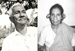

# Margarita(daughter of Vasthyav (Sebastin) 3.K.F.28)

- Branch : [Branch 3](Branch_3.md)
- Father : [Vasthyan](Vasthyan_son_of_Kochory_3.K.F.20-2.md)
- Brothers & Sisters : [Margarita](Margarita_daughter_of_Vasthyan_Sebastin_3.K.F.28-2.md), [K.S.Gabriel](K.S.Gabriel_son_of_Vasthyan_Sebastin_3.K.F.28-2.md), [Mariyamma](Mariyamma_daughter_of_Vasthyan_Sebastin_3.K.F.28-3.md), [Eleeswa](Eleeswa_daughter_of_Vasthyan_Sebastin_3.K.F.28-2.md), [K.S.Chearian](K.S.Chearian_son_of_Vasthyan_Sebastin_3.K.F.28-2.md), [Rev.Sr.Marey Beatrice](Rev.Sr.Marey_Beatrice_daughter_of_Vasthyan_Sebastin_3.K.F.28-2.md), [K.S.Joseph](K.S.Joseph_son_of_Vasthyan_Sebastin_3.K.F.28-2.md), [K.S.Antony](K.S.Antony_son_of_Vasthyan_Sebastin_3.K.F.28-2.md).
- Childrens: Vavachan, Achakunju, Thressyamma, Kathryna, Annie, Mary.

---

## Margaritha

3.Ch.F.66/G10(1)**MARGARITHA** [3.T.F.28&51] 1873--1950 married Pethrukutty Charankattu (Pandarapattathil) Chennavely. He was a wealthy and respectable gentleman. had two sons and four daughters.

G11.

1.  Vavachan( Silvester)1886 -1956(3.Ch.F.67)
2.  Achakunju (died in young.)1890-1910.
3.  Thressyamma 1892(3.Ch.F.68)
4.  Kathreena(Vava)(3.Ch.F.69).
5.  Annie( Anna kutty)(3.Ch.F.100)
6.  Mary(Mary remained as spinster.)

3.Ch.F.67/G11(1)VAVACHAN( Silvester)3.T.F. 66 married Mary daughter of Shouri, Punnakkatil Chennaveli. They had no off springs. A large number of attendants and friends always accompanied him. This mode of living led to the loss of much of his ancestral properties. He died in 1956.

3.Ch.F.68/G11(3) THRESSYAMMA[3.T.F. 66] married Lawrence Kizhakkanthalakal (Kurishinkal) Arthunkal They have four daughters.She was born in1892 and died in1959.

 [Gallery->](http://gallery.bizhat.com/branch-3/p212794-k-s-antony.html)

G12.

1.  Chinnamma (Anna)1919--21-6-1991
2.  Mariyamma 1922-31-8-2001.
3.  Victory 1927.
4.  Laisamma 1939.

3.Ch.F.69/G11(4) KATHREENA (Vava)1894-1960[3.T.F.66] married Ezakiel (5.K.F.119/G12(2).} son of Vissenthai, Koilparampil (Pazhaveetil)Kandakadave(Andickadavu). Ezakiel was an accomplished scholar in Sanskrit and practised Ayuvedic treatment at home he also ran a provisional shop.Ezakiel had five sons and a daughter. In 1938 shifted his house from Kandackadavu to KANNAMALI. where he inherited his paternal property. At the same time he took care to improve the landed property at Kandackadavu , which came to him through his mother. Ezakiel was born on1882and died on13-1-'57.

G12.

1.  K.E.Joseph (3.K.F.70)
2.  K.E.Michael(3.K.F.75).
3.  K.E.Anony(3.K.F.81).
4.  K.E. Vincent(3.K.87A).
5.  K.E.Xavier(3.K.F.88).
6.  Isabel(Leela)(3.K.F.93).

3.K.F.70/G12(1)K.E.JOSEPH 1915-25-6-1989[3.T.F. 69] during 2nd world war he served in Indian Army, after retirement, he ran provisional shop.In 1951 he married Mettilda, daughter of Sandhyavu Varghese and Elzabeth, Manassery. They had two sons and two daughters.

G13.

1.  K.J.Stanly(3.K.F.71).
2.  K.J.Issac(3.K.F.72).
3.  Jessy(3.K.F.73).
4.  Mercy(3.K.F.74).

3.K.F.71/G13(1)K.J.STANLY 3.T.F. 70] born in 1952 B.A. now he is working as a contractor in Cochin shipyard. He married Catherine(Dane) daughter of George Ferrick and Annie of Fort Cochin.

G14.

1.  Akhila Stanley 1989.

3.K.F.72/G13(2)K.J.ISSAC 1954[3.T.F. 70] after his diploma in Air-conditioning, he is empolyed ina shipping company at Saudi Arabia.

[3.K.F.73/G13(3)JESSY 1954 [3.T.F. 70] married Manuel son of Antony and Berty Pallathusseril at Fort Cochin.

G14.

1.  Antony.1982

3.K.F.74/G13(4)MERCY 1959 [3.T.F. 70] married Berty son of Ponnappan and Tressa Elainjickal, on 1982 at Fort Cochin.

G14.

1.  Soumya 1983.
2.  Swapna 1985.
3.  Steffy 1986.
4.  Aldril 1987.

3.K.F.75/G12(2)]K.E.MICHAEL 26-3-1919 after schooling he Joined the Indian Army.It was during the period of the 2nd world war after his retirement he under took contract works.He married Laissamma 20-11-1926(4.K.F.82) daughter of Silvester and Magdaleena, Koilparampil Arthunkal. They settled at Arthunkal, who had three sons and four daughters.

G13.

1.  K.M.Sasi (Silvester/Kuttn (3.K.F.76).
2.  MaryJain(3.K.76A).
3.  Mary Stella(3.K.76B)
4.  K.M.Antony Sunny(3.K.F.77).
5.  Marey Margrate(3.K.F.78)
6.  Francis Xavier(3.K.F.79).
7.  Rose Delima(3.K.79A).

3.K.F.76/G13(1)K.M.SASI(Kutten) Silvester1950 [3.T.F.75] married Annakutty daughter of Ouseph and Ealy Varavuline, Mutholi,near Kuruvinal St.Marey's Church. Sasi settled near the church. Address:- K.M.Sasi, Koilparampil house, Mutholi P.O., Pulunoor, Pala.

G14.

1.  Shali17-9-1994
2.  Elezabath 14-12-1996.

3.K.76A/G13(2).MARY-JANE 1952 [3.T.F. 75] remained as Spinster.

3.K.76B/G13(3).MARY STELLA 1954 [3.T.F. 75] remained as pinster.

3.K.F.77/G13(4).K.M.ANTONY SUNNY 1956 [3.T.F. 75] married Chinnamma daughter of Pappachan and Annamma, Ulladanchira, Pottickavala, Cherthala.

G14.

1.  No offsprings.

3.K.F.78/G13(5) MARY MARGARET 1958 [3.T.F. 75] married Thomas, son of Chacko and Ealyamma, Chitham-parampil at Thanneermuckum Cherthala. He is a P.W.D. Contractor, and the family settled in the wife house at Arthunkal.

G14.

1.  Blecy 1996.

[3.K.F.79/G13(6)K.M. FRANCIS XAVIER 1960 [3.T.F. 75] married Gracy daughter of Varghese Aratmmckil, Panavally, Cherthala. He settled in his wife's house.

G14.

1.  Michael 1996
2.  Binu

[3.K.80/G13(7)ROSE DELIMA 1970[3.T.F. 75] she works as Lab Tech.

3.K.F.81/G12(3) K.E. ANTONY 1924-8-11-1987 [3.T.F. 69] After education he joined the Indian Army during World war II in regiment (I.E.17E). After the war he resigned, later he married Thankamma (Mary) daughter of Varghese Manjeliveettil, Ernakulam. He settled at near the Mamangalam Church at EDAPPALLY. Address:-Thankamma Antony, Koilparampil, Kulurikkal, Chuttu-pattukara, Edappally P.O., Cochin 24.

G13.

1.  K.A.Johny(3.K.F.82).
2.  Janet(3.K.F.83).
3.  Silvy(3.K.F.84)
4.  Wilsy(3.K.F.85).
5.  Jancy(3.K.F.86).
6.  Grandon(3.K.F.87).

3.K.F.82/G13(1) K.A.JOHNY1957,[3.T.F. 81] now doing contract works formerly undertaken by his father.He married Margret 1964 daughter of Varghese and Cicily,Vellaparampil, Koratty. They have two sons, and the family resides at their ancestral home at MAMANGALAM.

G14.

1.  Hevin 21-9-1989.
2.  NevinJony 13-5-1993.

3.K.F.83/G13(2)JANET 1959[3.T.F. 81] married Josey son of Pappachan and the Thethamma, Cherukaraeth, Thrikkackara. Josey is a driver they resides at Thrikkackara.

G14.Dhanya 28-2-1985.

3.K.F.84/G13(3) SILVY1968 3.T.F. 81] married Yesudas son of Augustine, Pediackal house, Kaloor. He is employed in Rohiny Coconut oil cake company, Perumbavoor.

G.14. Siblmole 20-8-1993.

3.K.F.85/G13(4) WILSY 28-8-1970 [3.T.F. 81] employed in Solid at G.B.M.company Edappally.

3.K.F.86/G13(5) JANCY 1974 [3.T.F. 81] B.Com.doing C.A.

3.K.F.87/G13(6) GRANDON 1975 [3.T.F. 81]

3.K.87A/G12(4) K.E.VINCENT 1926-20-3-1993 [3.T.F. 69]lived as bachelor.

3.K.F.88/G12(5)Dr. K.E.XAVIER 22nd March 1931 [3.T.F. 69] after education he studied Homeopathy, and completed his studies in 1958 and started a dispensary near Kannamaly Church on 14Th Dec.1960, he married Elsy (Eathamma) 6.1.1933 --24.6.1991 3.T.F.100/G12. daughter of Dhumini Kunjan-Vaishyan, Kochickranvettle, Chetticad. They had Three sons and a daughter. Ph. 0484- 224 7699

G.13.

1.  K.X.Titus (Lal)(3.K.F.89).
2.  K.X.Melvin (Laj)(3.K.F.90).
3.  Marey. Darly(3.K.F.91).
4.  K.X.Jose (Lad)(3.K.92).

3.K.F.89/G13(1)K.X. TITUS (LAL)1962 [3.T.F. 88] After P.D.C.,I.T.I computer he employed in "Atlas engineering company" Ernakulam.He married Binu M.A. daughter of Abraham and Flora Valiyavettil, Kaloor on 24Th April 1994.

3.K.F.90/G13(2)K.X.MELBIN(LAJ)1966 [3.T.F. 88] . He is a contractor in Aluminium fabrication

3.K.F.91/G13(3)MARY DARLY 1964 [3.T.F. 88] (Lab. Technician ) married Augustine, son of Ouseph and Tressa, Vaimelil, Kaloor, on 22nd Nov. 1992.

G14.1,Sneha 1993.

3.K.92/G13(4) Fr. JOSE LAD 1971.[3.T.F. 88] After\> general education he joined the Seminary . On.2000 he Ordained as Priest.Now he is the Assistant Vacar at Pallithode St.Sebastin Church.

3.K.F.93/G12(6) ISABEL (LEELA)[3.T.F.69] 1933--9Th Jan.1994. married James son of Alexander, Velikkakathu, Kumbalangy. After retirement from military service,he worked in port trust a while. Being an Ex-service man, he acquired some land from the Government at Vettilappara in Ex-service men's colony, east of Chalakudy, the family resides there.

G13.

1.  Alex Finigon (3.Ve.F.94).
2.  Cathrine Vini (3.Ve.F.95).
3.  Mary Pamela(3.Ve.F96).
4.  Isac Benfield(3.Ve.F97).
5.  Tressa (3.Ve.F.98).
6.  Christy(3.Ve.F.99).

3.Ve.3.F.94/G13(1) ALEX FINIGON 22nd Jan. 1960[3.T.F.93] after education he worked as a Store-keeper in construction company, at Kashmir. Later he resigned from the company and returned to Kerla . Now he works in a private firm. He married Sosamma daughter of Jocob, Palliparamil at Pappangamucku, beach road, Cochin.

G14.

1.  Alex Antony 1985.

[3.Ve.F95/G13(2) KATHERINE VINI 10-12-1961 [3.T.F. 93] married James son of George (Vavachan) Valiyaveettil at Kumbalanghy.

G14.

1.  Preeya 1996.

3.Ve.F96/G13(3) MARY PAMELA (Twin sister of CatherineVini) 10.12.1961.[3.T.F.93] married Thomas , son of Antony and Rosamma, Kalathil house (Karumanchery) at Ezhupunna.

3.Ve.F97/G13(4) ISAC BENFIELD 1962 [3.T.F. 93] married Reena daughter of Debet and Aleese Arattukulam, Chellanam.

G14.

1.  Dhiviya 1996.

3.VE F98/G13(5) TRESA TELMA 1964 [3.T.F. 93] married Johanson B.Com.(running a medical shop named 'Kannuckadan medical enterprise at Chalackudy' son of Joseph and Mary Kannuckadan house, Vallanchira, Chalackudy

3.Ve.F99/G13(6)CHRISTY 1966 [3.T.F. 93] married Dinish, son of Mohan Shenoi, Pandickudy he running a cable T.V unit at Pandickudy.

G14.

1.  Dhilip 1993
2.  Dhepac 1995.

3.Ve.F100/G11(5) ANNIE (ANNA KUTTY)[[3.T.F. 66] married to Kunjan Vaishyan Kochikaranveettle, at Chetticad.

 [Click On Click->](http://gallery.bizhat.com/branch-3/p212794-k-s-antony.html)

G12.

1.  Elsy (Iethamma) born on 6Th Jan.1933.(She married her cousin
2.  Dr. K.E. Xavier3.K.F.88/G12(5) /5.K.F.141/G13(5)
