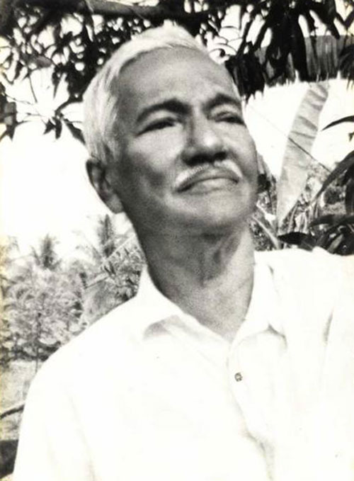

# Mariakutty (daughter of John Vasthyan)

- Branch : [Branch 3](Branch_3.md)
- Father: [K.S.Antony](K.S.Antony_son_of_Vasthyav_Sebastin_3.K.F.28.md)
- Brothers & Sisters : [Mariakutty](Mariakutty_daughter_of_John_Vasthyan.md).
- Childrens : K.A. Sebastin , [Evamma](K.J.Jacob_son_of_K.S.Joseph_3.K.F.218-2.md) , [K.A.Thankachan](K.A.Thankachan_son_of_K.S.Antony_3.K.F.254.md) , [K.A.Kochappan](K.A.Kochappan_son_of_K.S.Antony_3.K.F.254.md) , [K.A.Edison](K.A.Edison_son_of_K.S.Antony_3.K.F.254.md) , [Kusumum](Kusumum_daughter_of_K.S.Antony_3.K.F.254.md) , [K.A.Cherian](K.A.Cherian_son_of_K.S.Antony_3.K.F.254.md) , [K.A.Josey](K.A.Josey_son_of_K.S.Antony_3.K.F.254.md) , [K.A.George Kutty](K.A.George_Kutty_son_of_K.S.Antony_3.K.F.254.md)

---

## K.S.ANTONY (ANTHAPPAN)

 Mr.& Mrs. K.S.Antony

3.K.F.254/10G (8).**K.S.ANTONY (ANTHAPPAN)** 3.T.F.28&51 25.5.1892 to 17.7.1979. He was born as the youngest son among the four brothers and three sisters of Koilparampil Vasthyan and Anna, Arthunkal. He did his matriculation in the Leo XIII th High School Alappuzha by staying in the house of the 'Kappiyar ( sexton) Church. The family property division was done these days, when he was very young. Thus his share was at his disposal. As a positive reaction to the spread of a talk about him that he would simply squander away the property by getting addicted and loose spending if he personally handles in his property share. He took an oath that he would never touch drinks in life, which he kept till the end of his life. Reading the English fictions was a hobby to him. It is said that he read the biography of 'Napoleon by Abbot' three times. He used to say that it was the persistent hard work of Napoleon that made him emperor and so Napoleon should be taken as the model in life. He was a scholarly person in English. By the closing phase of his education he turned his interest to sports and games. He was famous in the fields of badminton and football. He was the captain of the team; they tour all over Travancore, Cochin and Madras, in many tournaments. He was also the member of the famous "Excelsior" badminton club at Alleppy. I got occasions to hear the responses of his admirers complementing that he was the most noted sportsman of the period in 1910 to 1925. There was a write up about a page in the Malayala Manorama daily about him in those days. It was told that persons like Kurisupurakkal K.D.Joseph Arthunkal, former minister T.V. Thomas, Cherupallikat Sebastin Sir Cherthala, Joseph Pattam of Puliinkunnu, Vaidyanath Iyar D.S.P. of North Paravoor, Varghese Puthenpurakkel of Kannamaly etc. were his fellow players. The noble and aristocratic way of dressing for men in those days was Dhothy and Coat, and over the coat at the shoulder, a long-folded cloth with six inches golden threads (Kasav Neriyathu) would be laid. The number of medals went on increasing on his coat, play after play. He used to cover his medals on the coat by his 'Kasavu-Neriyathu' while he step in to the stage. Once he was invited and treated in a grand way at Thrissur after his winning in the play, by the Koilparampil (Tharakanmar) who had come from places like Mullassery, Pavaratty etc. It was from the aged people of these Tharakan families at Thrissur that he came to know the family history, and the present Koilparampil families in south Kerala were the descendants of those families belonging to Koilparampil "Tharakanmar" of Thrissur who had moved towards south, centuries ago. From sports, his interest shifted to stage drama he organized a drama group and was admired in performing the well-known dramas like "Julius Caesar," "Macbth,"(English)"Karnaki", "Nallathanka","Anarkily","Savethry-sathavan", "Karuna", "Janasundari" "Veanadinta-aduthune" etc., reference The Samakalika "Malayalam" Varika 13 th. September 2002. Page 5, by Dr.K.Sree Kumar from Kozhikode were written by a relative Mr. Andrews master (Vazhakuttthil) from Chellanam. These dramas were staged in the following places, Arthunkal, Aluva, Malayattoor, and Kanjiur and also in princely states like TravancureCochin. In Those days a 'Bhaghavatar' (Singer) is the essential member in the drama stage.

Today's well-known singer Dr.J.Yesudas's father Shri. Augustine Joseph is a member of this drama group as a Bhaghavadar. Among the actors Kunju kunju Bhaghavadar one of his relatives, it is said that he took much pain and strain to bring him in the limelight. At the age of 33, he married **[Mariakutty](Mariakutty.md)** (4.6.1907 to 2.12.1992) daughter of John Vasthyan and Clara[daughter of Anthony and (Mariyamma Kurisunkal, at Kochi) Karumamchery Ezhupunna], of srampickal (Vadakkemuri) Pallithode. There are nine children to this couple. During the time of World war II, the family was shifted to Pallithode and reclaimed the paddy fields of Mariakutty's share and constructed a house in center of paddy field. Hence, the added names to the family as 'Dweepukar/Dweepil'. He took the initiative to develop the paddy cultivation by constructing 'bund' at the northern canal and blocked the flow of salt water from "Anthakaranazhy". Thus, all the fields lying on the eastern side of the Pallithode church (the old name was "Srampickal church") were made fit for paddy cultivation; this enabled the other families developed in to affluence. The 'Dweep' was as a Paradise. Being jealous of this affluence, some started to create problems by blocking the water path and by filing cases. There were also sicknesses, which disturbed in an unbearable way and the residence then was shifted to Arithunkal. Is painful to add that, by then the agriculture in Pallithode completely collapsed. Among the brothers, he showed much affection to the eldest brother, there had not any counter word from him to the wishes and opinions of eldest brother. He was also very much fond of helping others and catering the guests. He was one of the founding members of the Arthunkal coconut farmers association ('Kera Karshaka Sangam'). He served as President of the Koilparampil family forum ('Kudumba Yogam') for a long time. The affectionate relationship of these couples as a couple was a model to others to emulate. They had a very meaningful married life without any conflict but with a strong base of understanding mutual faith and help. They embraced the eternity in 17th July 1979 at the age of 87, in the case of K.S. Antony, and in 2 Dec 1992 at the age of 85 in the case of Maria kutty.

Fig.1 standing : Kusumum, helper Anna, Thankachan, Evamma, Kochappan, helper Mettelda and Edison sitting : Mariyakutty Antony, Clara John, K.S.Antony and Cheriyan. Fig.2. Standing : Thankachan, Kochappan, Edison, Cheriyan, Josey and George kutty. Sitting : Evamma Mr.& Mrs.K.S.Antony and Kusumum.

G.11.

1.  K.A. Sebastin (5th June1927-20th June 1927).
2.  [Evamma](K.J.Jacob_son_of_K.S.Joseph_3.K.F.218-2.md)(Evamma)(3.K.F.255).
3.  [K.A.Thankachan](K.A.Thankachan_son_of_K.S.Antony_3.K.F.254.md)(Thankachan)(3.K.F.256).
4.  [K.A.Kochappan](K.A.Kochappan_son_of_K.S.Antony_3.K.F.254.md)(Eugene Varghese / Kochappan)(3.K.F.257).
5.  [K.A.Edison](K.A.Edison_son_of_K.S.Antony_3.K.F.254.md)(John Edison)(3.K.F.258).
6.  [Kusumum](Kusumum_daughter_of_K.S.Antony_3.K.F.254.md)(Clara Clementine)(3.K.F.259).
7.  [K.A.Cherian](K.A.Cherian_son_of_K.S.Antony_3.K.F.254.md)(Francis Cherian / Ponnappan)(3.K.F.260).
8.  [K.A.Josey](K.A.Josey_son_of_K.S.Antony_3.K.F.254.md)(Joseph)(3.K.F.261).
9.  [K.A.George Kutty](K.A.George_Kutty_son_of_K.S.Antony_3.K.F.254.md)(Jacob Louis George)(3.K.F.262).

Chochappen Clara John Srampical 3.Ka.F.254 A.(It must be relevant and contextual to mention about the relation with other families before we goto K.S.Antony's descendants. Anthony and Mariyamm of Karumanchery Ezhupunna had got the following children

1.  Esthapanous (puthenpurack al )
2.  Garvasiyous (Thattupurackal).
3.  Pascal(Nikarthil),
4.  Chochappen(Kambolathparampil).
5.  Verony(Thekkeveetil).
6.  Clara (Srampical).
7.  Anasthacy(Koilparampil

Clovedeena(Odathunkal). 9,Kunjamma (Vellapally)

3.S.F.254B/G1. Clara married John (son of) srambickal, at Pallithode.

G.2.

1.  S.J.Varghese.
2.  Mariyakutty.
3.  S.J.Joseph.4, .
4.  S.J.Pascal

S.J.VARGHESE married Mariyamma daughter of Valiyathayil(Presenation) at Kattoor,Alleppy.

G.3.

1.  S.V.Wilfred.
2.  Jainamma.
3.  Rajamma.
4.  Rev.Fr.Clarance Srampickal.
5.  Ponnamma (Rev.Mother Mary Caroline Visitation Superior Genaral)

Mariyakutty married K.S.Antony [see 3.K.F.254/G10(8)]

Mr.& Mrs.S.J.Joseph and Edison S.J.JOSEPH (Fist Post Master in Pallthode) married Thankamma daughter of joseph, Kakkary, Chennavely Arthunkal.

G.3.

1.  S.J.Loveline.
2.  S.J.Edison B.A.B.Ed.(Teacher).
3.  Sivigin.
4.  Tenison.
5.  Lalitha
6.  Sebastion (Post master).

S.J.Pascal (Co-Operative inspector) married Rageena daughter of Edathattil, Alapuzha.

G.3.

1.  John Pascal(Joy),
2.  Marikutty.
3.  Boben.

---

[Branch 3-K.S. Antony](Branch_3-K.S._Antony.md)

## Mariakutty

(4.6.1907 to 2.12.1992) daughter of John Vasthyan and Clara[daughter of Anthony and (Mariyamma Kurisunkal, at Kochi) Karumamchery Ezhupunna], of srampickal (Vadakkemuri) Pallithode.

Anthony and Mariyamm of Karumanchery Ezhupunna had got the following children 1,Esthapanous (puthenpurack al )

2 Garvasiyous (Thattupurackal).

3,Pascal(Nikarthil),

4,Chochappen(Kambolathparampil).

5,Verony(Thekkeveetil).

6,Clara (Srampical).

7,Anasthacy(Koilparampil4.K.F.569/G12)

8,Clovedeena(Odathunkal).

9,Kunjamma (Vellapally)

3.S.F.254B/G1. Clara married John (son of) srambickal, at Pallithode.

G.2. 1,S.J.Varghese.

2,Mariyakutty.

3,S.J.Joseph.4,

5,S.J.Pascal

3.S.F.254B/G2(1) S.J.VARGHESE married Mariyamma daughter of Valiyathayil(Presenation) at Kattoor,Alleppy.

G.3. 1, S.V.Wilfred.

2,Jainamma.

3,Rajamma.

4,Rev.Fr.Clarance Srampickal.

5,Ponnamma (Rev.Mother Mary Caroline Visitation Superior Genaral)

3.S.F.254B/G2(2) Mariyakutty married K.S.Antony [see 3.K.F.254/G10(8)][Branch 3-K.S. Antony](Branch_3-K.S._Antony.md)

3.S.F.254B/G2(3) S.J.JOSEPH (Fist Post Master in Pallthode) married Thankamma daughter of joseph, Kakkary, Chennavely Arthunkal. G.3. 1,S.J.Loveline.

2,S.J.Edison B.A.B.Ed.(Teacher).

3,Sivigin.

4,Tenison.

5,Lalitha

6,Sebastion (Post master).

3.S.F.254B/G2(5) S.J.Pascal (Co-Operative inspector) married Rageena daughter of Edathattil, Alapuzha. G.3. 1,John Pascal(Joy),

2, Marikutty.

3, Boben.
