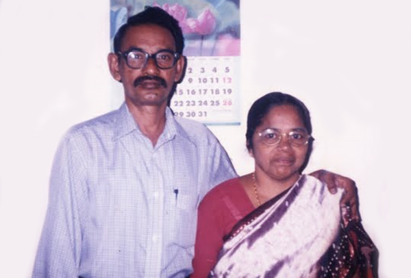

# Monamma(Corona valentine)

- Branch : [Branch 3](Branch_3.md)
- Father: [K.S.Antony](K.S.Antony_son_of_Vasthyav_Sebastin_3.K.F.28.md)
- Brothers & Sisters : [K.A.Cherian](K.A.Cherian_son_of_K.S.Antony_3.K.F.254.md)
- Childrens: Rekha , Renu

---

## K.A.FRANCIS CHERIAN (PONNAPPAN)

 Mr.& Mrs. Cherian.K.A

Joseph Valentine and Celeena, of Mangalamuttathu, Kovilthottam, Kollam. The marriage was on 14-4-1971 Wednesday. Monamma is working as an Aganwadi teacher. Ph. 0478 257 1091.

G.12.

1.  Aloysious Valentine(Kunjapi)
2.  Loosy william
3.  Monamma(Corona valentine)
4.  Titus Valentine
5.  Pious Valentine(Paus)
6.  Nirmala Yesudas
7.  Herold Valentine(Monappan)
