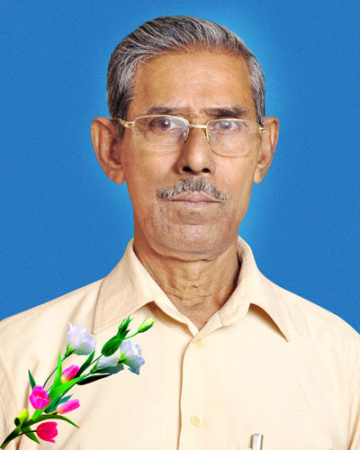

# Obituaries

Belsita Edison passed away

---

[K.C.EAPEN](K.C.Eapen_son_of_K.S.Cheriyan_Mapillai_3.K.F.101-2.md)

---

[K.A. Varghese](K.A._Varghese_Eugene_Varghese_Kochappan.md) passed away on 21-Jan-2012.

---

subject : DEATH OF MY FATHER - MR. SEBASTIAN JOSEPH KOILPARAMPIL ON 28TH NOV, 2008

5TH OCTOBER, 2009

MR. K. A VARGHESE KOIL PARAMPIL ARTHUNKAL P O ALAPUZHA - 688530 KERALA STATE

Dear Sir, With reference to the above, I Selene Thomas daughter of Mr. Sebastian Joseph like to inform your goodself about my father's death.

He was born in Alleppy, Kerala in 1821 and was married to Madam Mary Cruz Fernandez of Trivindrum. My mother passed away 12 years ago in 1998. They have 4 children all of whom are happily married - 2 boys and 2 girls. My father used to work for the British Army in Malaysia during the 2nd world war. My eldest sister Baby Theresa Juliet lives in London. She is midwife. My eldest brother Hendry Joseph works in Kuala Lumpur in KFC and myself is a Lecturer in Malaysian Legal Secretaries teaching Computer Typing and Communication.

My youngest brother Andrew Joseph is with Great Eastern Life Insurance. All of them are blessed with one kid whereelse I am blessed with 8 kids. My sister has a daughter Sophia Mary Grace, my eldest brother a daughter Mischelle Hendry and my youngest brother has a son Ashwin Andrew. I have 5 daughters Caroline Louise, Cassandra Thomas, Carissa Thomas, Chriselda Thomas, Chantal Rose Thomas and my sons are John Paul Thomas, Joshua Ross Thomas and Jonathan Solomen. My children ages range from 26-11 years old. My brothers children Mischelle (23 yrs old) Ashwin (16 yrs old) Baby Sophia is 6 months old. Kindly put the above information in the Obituaries coloumn. My father was a good and responsible father. We loss a great man. Thank you very much for help rendered.

I can be contacted as follows : Mrs. Selene Thomas No 2 Lorong Sentul Bahagia 2 Sentul Pasar Dalam 51100 Kuala Lumpur

---

Sr.BEATRICE

MARIAMMA JOSEOH

K.C PAPPY

K.F JOSEPH
