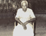

# Thamby (son of Changy 6.K.F.105)

- Branch : [Branch 6](Branch_6.md)
- Father : [Changy](Changy_son_of_Kunchu_6.K.F.4A-2.md)
- Brothers :[Thamby](Thamby_son_of_Changy_6.K.F.105.md) , Vava
- Childrens: Vasthyon , Ghangy , Joseph , Clara , Rosary , Christeena

---

## THAMBY

6.K.F.106/G10(1)THAMBY 1881 [6.T.F.105] married Aganisa daughter of Kochousay and Clara {3.Vl.F.23/G11(2)}, Valiyathayil at Kattoor.

G.11.

1.  Vasthyon 1906(6.K.F.107).
2.  Ghangy(John)1908(6.K.F.114).
3.  Joseph 1910 (6.K.F.122).
4.  Clara 1912(6.K.F.131).
5.  Rosary 1914 (6.K132).
6.  Christeena 1916(6.K.F.133).

6.K.F.107/G11(1) VASTHYON 1906 [6.T.F.106] married Vavakutty, Pollayil, Chellanam.

G.12.

1.  Kochupennu(Prastheena)1931(6.K.F.108)
2.  Thorosya 1933 (6.K.F.109).
3.  Chinnamma (Emerasya).1935 (6.K.F.110).
4.  Kuttappan(Louis) 1937(6.K.F.111).

6.K.F.108/G12(1)KOCHUPENNU (Prastheena)1931-19.7.2001[6.T.F.107] married Joseph from Kumarakom, Kottayam.

G.13.

1.  Thankamma 1950.
2.  Kunjukunju 1952.
3.  Maniyappen (Antony)Rtd Sub Inspector 1954.

6.K.F.109/G12(2)THOROSYA 1933 [6.T.F.107] married Ealiyas measery Tharayil and settled at Kumarakom.

G.13.

1.  Kunjappan(Leion) 1958.
2.  Kunjumone 1960.
3.  Thamby1962.

6.K.F.110/G12(3)CHINNAMMA (Emerasya) 1935 [6.T.F.107] married Varghese Theakkpalackal Kattoor.

G.13.No offsprings .

6.K.F.111/G12(4)KUTTAPPAN (Louis)1937-15.10.1998 [6.T.F.107] married Lelamma(Susanna) Thekkapalackal Kattoor.

G.13.

1.  Jijo (Marshal Sebastion)28.12. 1967.(6.K.F.112).
2.  Shinamma (Theckla) 1969.(6.K.F.113).

6.K.F.112/G13(1).JIJO (Marshal Sebastion) 28.12.1967—27.11.03[6.T.F.111] married Graceamma, daughter of Kuttappan Arasserkadavil at Mararikulam. JiJo expired in an accident.

G.14.

1.  Rakhi (Susan Marshal) 1995.
2.  Tito Sebastion 1997.

6.K.F.113/G13(2)SHAINAMMA (Theckla)1969 [6.T.F.111] married Ousephen son of Paul Kakkariy Chennavely.

G.14.

1.  Sanny 1990.

6.K.F.114/G11(2)GHANJY(John) 1908 [6.T.F.106] married Mary, daughter of Rapel Valiyavettle Pallithode.

G.12.

1.  Neelamma 1928(6.K.F.115).
2.  Angilose 1929 (6.K.116)
3.  Susanna 1930 (6.K.117).
4.  Willom 1931(6.K.F.118).
5.  Kochu Therasya 1932 (6.K.F.119).
6.  Valiya Therasya (Kochammachi)1934(6.K 120).
7.  Engrattis 1938 (6.K 121).

6.K.115/G12(1)NLAMMA 1928-1980[6.T.F.114]lived as unmarried

6.K.116/G12(2).K.J. ANGILOSE 1929-1990 [6.T.F.114] Lived as bachelor (Photo in sitting pose).

6.K.117/G12(3) SUSANNA 1930 [6.T.F.114] is a unmarried

6.K.F.118/G12(4).K. J. WILLOM 1931 [6.T.F.114] married Alphonsa daughter of Pawly and Mary Vadckethalackal, Kumbalangi.

G.13.No offsprings.

6.K.119/G12(5)KOCHU THRESYA1932-1992 [6.T.F.114] married John Kutty son of Dhumikose Jusenju Kurisinkal (Thekke-kalluveettle) Aruthunkal.

G.13.

1.  Mohan (Peter)1955.
2.  Lisy kutty 1958.
3.  Mary Margret1964.
4.  Rameage Basil 1968.

6.K.120/G12(6)VALIYA THERASYA(Kochammachy) 1934 [6.T.F.114] she is a bachelor girl.

6.K.121/G12(7)ENGRATTIES 1938 [6.T.F.114] is a bachelor girl.

6.K.F.122/G11(2)JOSEPH 1910 [6.T.F.106] married Saramma,daughter of Sebastion Valiyathayil, Kattoor. This family settled at Kattoor.

G.12.

1.  Nelson1929(6.K.F.123).
2.  Thambi(Alocious)1932(6.K.F.124)
3.  Janamma(Treesya)1934(6.K.F.128)
4.  Rosline(Agnaus)1936(6.K.F.129)
5.  Kunjamma1940(6.K.F.130).

6.K.F.123/G13(1).NELSON 1929 [6.T.F.122] married Mariyamma 1954 daughter of Antony Vaidhyan, Arreasserial Aruthunkal. Address:- Mariyamma Nelson, Koilparampil, Kattoor.Ph. 0477-225 9851.

G.14.

1.  Santhosh (Jose Antony)3.12.1972.
2.  Anumole (Jospheena Dolphy) 1976.
3.  Tony 1978.

6.K.F.124/G13(2).THAMBYAlocious)1932 [6.T.F.122] married Kunjamma (Martha)1943 daughter of Pappachan and Rageena Arattukulangara Pallithode.

G.14.

1.  Sabu (Ignatious)15.5.1961 (6.K.F.125).
2.  Sajan (Edison) 1968(6.K.F.126).
3.  Saly(Isabella)1974(6.K.F. 127).

6.K.F.125/G14(1).SABU (Ignatious) 15.5.1961 [6.T.F.124]married Lovely 28.5.1968, daughter of Benadit and Rosamma Pallyckethyil Polleathai. Address : Sabu Koilparampil, Kattoor P.O. Mararikulam south. Ph.0477-225 8783

G.15.

1.  Immanuvel 25.12.1987.
2.  Nenakutty (Margrate)27.2.92.
3.  Ninuthakutty16.6.1996.
4.  Neeraja 2.8.1999.

6.K.F.126/G14(2).SAJAN (EDISON) 1968,[6.T.F.124] married Binimole, daughter of Kunjappan and Thasamma Charamcat Chennavely.

G.15.

1.  Ammukutty 14.11.1998.

6.K.F.127/G14(3)SALY (Ezabella)1974[6.T.F.124]married Joseph son of Antony and Rosila Anjilyparampil, Vadackel.

G.15.

1.  Maymole(Rosilin)1989.
2.  Jose Antony1991.3,Agi 1996.

6.K.F.128/G12(3)JANAMMA (Treesa)1934 [6.T.F.122] married Peter Puthenpurackal Chethy.

6.K.F.129/G12(4)ROSLINE(Agnaus) 1936 [6.T.F.122] married Joseph Nadeeparampil Thumboly Family settled at Kattoor.

G,13.

1.  Shinamma
2.  Tomy .

6.K.F.130/G12(5)KUNJAMMA [6.T.F.122]married John (Thankachan) Pallickethyil Aruthunkal.

G.13.

1.  Nobil 1982.

6.K.F.131/G11(4)CLARA [6.T.F.106] married Peter Polleathyil.

G.12.

1.  Kunjamma.
2.  Chinnappan.
3.  Ealiyamma.
4.  Yugin(teacher).

6.K.132/G11(5) Sr. Rosary[6.T.F.106]

6.K.F.133/G11(6)CHRISTHEENA [6.T.F.106] married Sebastion Valiyathayil Kattoor.

G.12.

1.  Henry1926.
2.  Chellappan 1928.
3.  Treesamma 1930.
4.  Rainold (Kunjukunju)1932.
5.  Pennamma 1934.
